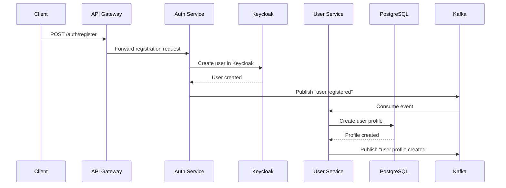
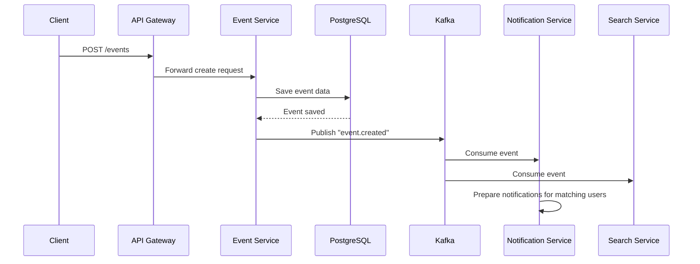

# WingDing Party техническое описание платформы для организации событий

## 1. Описание проекта

**WingDing Party** — это платформа для организации тематических встреч, знакомств по интересам и общения в рамках закрытого клубного сообщества.  
Платформа построена на микросервисной архитектуре с использованием .NET и обеспечивает создание событий, подбор рекомендаций и коммуникацию между пользователями.

**Основные возможности:**

- Создание и управление профилями пользователей с указанием интересов
- Организация событий различных типов (квартирники, походы в театр, бар, кино, мастер-классы)
- Система рекомендаций событий на основе интересов пользователя
- Регистрация на события, управление участием
- Клубная система по интересам
- Система оценок и отзывов проведенных событий
- Внутренний чат для общения участников
- Уведомления о новых событиях и активности

## 2. Основные задачи

### Бизнес-задачи:

- Создание закрытого клубного сообщества по интересам
- Организация и продвижение тематических встреч
- Облегчение знакомств между людьми со схожими интересами
- Обеспечение безопасной и комфортной среды для общения

### Технические задачи:

- Разработка отказоустойчивой микросервисной архитектуры
- Реализация безопасной аутентификации и авторизации
- Создание системы рекомендаций на основе интересов
- Реализация real-time чата
- Разработка системы уведомлений
- Интеграция полнотекстового поиска

### Технические требования:

- Платформа реализована как набор микросервисов на .NET 8/10 (LTS),
- Использует Apache Kafka для асинхронной коммуникации,
- Комбинирует REST/gRPC для синхронных вызовов,
- PostgreSQL для транзакционных данных,
- Redis для кеширования и сессий,
- S3-совместимое хранилище (MinIO) для медиафайлов (аватары, фото событий).
- Аутентификация и авторизация реализованы через OIDC (Keycloak).

---

## 3. Роли пользователей и бизнес-процессы

### Роли

|Роль|Описание|Permissions|
|---|---|---|
|**Guest**|Неавторизованный пользователь|Просмотр публичных событий, регистрация|
|**User**|Зарегистрированный пользователь|Полный доступ к функционалу: создание событий, чаты, отзывы|
|**Moderator**|Модератор|Управление контентом, модерация событий и отзывов|
|**Administrator**|Администратор системы|Управление пользователями, глобальные настройки, мониторинг|

### Сценарии взаимодействия

#### Регистрация и создание профиля

1. Клиент → API Gateway: POST /auth/register
2. API Gateway → Auth Service: POST /auth/register
3. Auth Service → Keycloak: Create user
4. Auth Service → User Service: Create user profile via Kafka
5. User Service → PostgreSQL: Save user profile with interests
6. User Service → Kafka: Publish "user.registered"
7. Search Service ← Kafka: Consume "user.registered" for indexing

#### Создание события

1. Клиент → API Gateway: POST /events (with JWT)
2. API Gateway → Auth Service: Validate JWT
3. API Gateway → Event Service: Create event request
4. Event Service → PostgreSQL: Save event data
5. Event Service → Kafka: Publish "event.created"
6. Notification Service ← Kafka: Consume "event.created"
7. Search Service ← Kafka: Consume "event.created" for indexing


## 4. Микросервисы

### 1. Auth Service

**Ответственность:** Управление пользователями, аутентификация, авторизация

**Технологии:**

- .NET 8
- Keycloak Integration
- PostgreSQL (пользовательские данные)
- Redis (сессии)

**API Endpoints:**

```csharp

// REST API
POST /api/auth/login          // OIDC flow initiation
POST /api/auth/register       // User registration
POST /api/auth/refresh        // Token refresh
GET  /api/users/profile       // User profile

// gRPC Service
service UserService {
    rpc ValidateToken (TokenRequest) returns (UserResponse);
    rpc GetUserPermissions (UserRequest) returns (PermissionsResponse);
}
```

**События Kafka:**

- `user.registered` - новый пользователь
- `user.updated` - обновление профиля
- `user.deleted` - удаление пользователя

**Модель данных:**
```sql
CREATE TABLE users (
    id UUID PRIMARY KEY,
    username VARCHAR(50) UNIQUE NOT NULL,
    email VARCHAR(255) UNIQUE NOT NULL,
    role VARCHAR(20) DEFAULT 'user',
    created_at TIMESTAMPTZ DEFAULT NOW(),
    is_active BOOLEAN DEFAULT true
);

CREATE INDEX idx_users_email ON users(email);
CREATE INDEX idx_users_username ON users(username);
```

### 2. User Profile Service

**Ответственность:** Управление профилями пользователей, интересами, клубами

**Технологии:**

- .NET 8 (Minimal API)
- PostgreSQL (профили, интересы, клубы)
- Redis (кеш профилей)

**API Endpoints:**

```csharp
// Minimal API
GET /profiles/{userId}              // Получение профиля
PUT /profiles/{userId}              // Обновление профиля
GET /profiles/{userId}/interests    // Интересы пользователя
POST /profiles/interests            // Добавление интересов
GET /clubs                          // Список клубов
POST /clubs                         // Создание клуба
POST /clubs/{clubId}/join          // Вступление в клуб
```

**События Kafka:**

- `user.profile.updated` - обновление профиля
- `user.interests.updated` - изменение интересов
- `club.created` - создан новый клуб

**Модель данных:**
```sql
CREATE TABLE user_profiles (
    id UUID PRIMARY KEY REFERENCES users(id),
    display_name VARCHAR(100),
    bio TEXT,
    avatar_url VARCHAR(1000),
    interests VARCHAR(100)[],
    location VARCHAR(100),
    birth_date DATE,
    created_at TIMESTAMPTZ DEFAULT NOW(),
    updated_at TIMESTAMPTZ DEFAULT NOW()
);

CREATE TABLE clubs (
    id UUID PRIMARY KEY,
    name VARCHAR(255) NOT NULL,
    description TEXT,
    owner_id UUID REFERENCES users(id),
    interests VARCHAR(100)[],
    is_public BOOLEAN DEFAULT true,
    created_at TIMESTAMPTZ DEFAULT NOW()
);

CREATE TABLE club_members (
    club_id UUID REFERENCES clubs(id),
    user_id UUID REFERENCES users(id),
    joined_at TIMESTAMPTZ DEFAULT NOW(),
    PRIMARY KEY (club_id, user_id)
);

CREATE INDEX idx_profiles_interests ON user_profiles USING GIN(interests);
CREATE INDEX idx_clubs_interests ON clubs USING GIN(interests);
```

### 3. Event Service

**Ответственность:** Управление событиями, регистрациями, рекомендациями

**Технологии:**

- .NET 8 (ASP.NET Core)
- PostgreSQL (события, регистрации)
- Redis (кеш рекомендаций, очереди регистраций)

**API Endpoints:**

```csharp
// REST API
POST /events                      // Создание события
GET /events/{id}                  // Получение события
PUT /events/{id}                  // Обновление события
DELETE /events/{id}               // Удаление события
POST /events/{id}/register        // Регистрация на событие
GET /events/recommended           // Рекомендованные события
GET /events/search                // Поиск событий
```

**События Kafka:**

- `event.created` - создано новое событие
- `event.updated` - обновление события
- `event.registration.created` - новая регистрация
- `event.completed` - событие завершено

**Модель данных:**
```sql
CREATE TABLE events (
    id UUID PRIMARY KEY,
    title VARCHAR(500) NOT NULL,
    description TEXT,
    organizer_id UUID REFERENCES users(id),
    event_type VARCHAR(50) NOT NULL, -- квартирник, театр, бар, кино, мастер-класс
    interests VARCHAR(100)[],
    max_participants INT,
    start_time TIMESTAMPTZ NOT NULL,
    end_time TIMESTAMPTZ,
    location VARCHAR(500),
    price DECIMAL(10,2) DEFAULT 0,
    created_at TIMESTAMPTZ DEFAULT NOW(),
    status VARCHAR(20) DEFAULT 'planned' -- planned, active, completed, cancelled
);

CREATE TABLE event_registrations (
    id UUID PRIMARY KEY,
    event_id UUID REFERENCES events(id),
    user_id UUID REFERENCES users(id),
    registered_at TIMESTAMPTZ DEFAULT NOW(),
    status VARCHAR(20) DEFAULT 'registered', -- registered, attended, cancelled
    UNIQUE(event_id, user_id)
);

CREATE TABLE event_reviews (
    id UUID PRIMARY KEY,
    event_id UUID REFERENCES events(id),
    user_id UUID REFERENCES users(id),
    rating INT CHECK (rating >= 1 AND rating <= 5),
    comment TEXT,
    created_at TIMESTAMPTZ DEFAULT NOW(),
    UNIQUE(event_id, user_id)
);

CREATE INDEX idx_events_interests ON events USING GIN(interests);
CREATE INDEX idx_events_time ON events(start_time);
CREATE INDEX idx_events_type ON events(event_type);
```

### 4. Chat Service

**Ответственность:** Real-time общение, управление чатами

**Технологии:**
- .NET 8 (ASP.NET Core + SignalR)
- PostgreSQL (история сообщений)
- Redis (кеш активных сессий, pub/sub)

**API Endpoints:**

```csharp
// REST API
GET /chats                          // Список чатов пользователя
POST /chats                         // Создание чата
GET /chats/{chatId}/messages       // История сообщений
POST /chats/{chatId}/messages      // Отправка сообщения

// SignalR Hubs
ChatHub - real-time сообщения
PresenceHub - онлайн статусы
```

**События Kafka:**

- `chat.message.sent` - отправлено сообщение
- `chat.created` - создан новый чат
- `user.typing` - пользователь печатает

**Модель данных:**
```sql
CREATE TABLE chats (
    id UUID PRIMARY KEY,
    name VARCHAR(255),
    type VARCHAR(20) DEFAULT 'private', -- private, group, event, club
    event_id UUID REFERENCES events(id),
    club_id UUID REFERENCES clubs(id),
    created_at TIMESTAMPTZ DEFAULT NOW()
);

CREATE TABLE chat_participants (
    chat_id UUID REFERENCES chats(id),
    user_id UUID REFERENCES users(id),
    joined_at TIMESTAMPTZ DEFAULT NOW(),
    PRIMARY KEY (chat_id, user_id)
);

CREATE TABLE messages (
    id UUID PRIMARY KEY,
    chat_id UUID REFERENCES chats(id),
    user_id UUID REFERENCES users(id),
    content TEXT NOT NULL,
    sent_at TIMESTAMPTZ DEFAULT NOW(),
    read_at TIMESTAMPTZ
);

CREATE INDEX idx_messages_chat ON messages(chat_id, sent_at);
CREATE INDEX idx_chats_event ON chats(event_id);
CREATE INDEX idx_chats_club ON chats(club_id);
```

### 5. Notification Service

**Ответственность:** Управление уведомлениями, рассылки

**Технологии:**

- .NET 8 (Worker Service)
- PostgreSQL (уведомления)
- Redis (очередь уведомлений)

**API Endpoints:**

```csharp
// REST API
GET /notifications                 // Уведомления пользователя
PUT /notifications/{id}/read      // Отметка как прочитано
POST /notifications/preferences   // Настройка уведомлений

// gRPC Service
service NotificationService {
    rpc SendNotification (NotificationRequest) returns (NotificationResponse);
    rpc GetUserPreferences (UserRequest) returns (PreferencesResponse);
}
```

**События Kafka:**

- `notification.sent` - отправлено уведомление
- `notification.read` - уведомление прочитано

**Модель данных:**

```sql
CREATE TABLE notifications (
    id UUID PRIMARY KEY,
    user_id UUID REFERENCES users(id),
    title VARCHAR(255) NOT NULL,
    message TEXT NOT NULL,
    type VARCHAR(50) NOT NULL, -- event_invite, new_message, event_reminder
    related_entity_type VARCHAR(50), -- event, chat, user
    related_entity_id UUID,
    is_read BOOLEAN DEFAULT false,
    created_at TIMESTAMPTZ DEFAULT NOW()
);

CREATE TABLE notification_preferences (
    user_id UUID REFERENCES users(id),
    notification_type VARCHAR(50),
    enabled BOOLEAN DEFAULT true,
    PRIMARY KEY (user_id, notification_type)
);

CREATE INDEX idx_notifications_user ON notifications(user_id, created_at);
CREATE INDEX idx_notifications_unread ON notifications(user_id) WHERE is_read = false;
```

### 6. Search Service

**Ответственность:** Полнотекстовый поиск по событиям, пользователям, клубам

**Технологии:**

- .NET 8 (Worker Service)
- Elasticsearch
- PostgreSQL (primary storage)

**API Endpoints:**

```csharp
// REST API
GET /search?q={query}&type={entityType}  // Поиск по всем сущностям
GET /search/events?q={query}            // Поиск событий
GET /search/users?q={query}             // Поиск пользователей
GET /search/clubs?q={query}             // Поиск клубов
```

**События Kafka:**

- `search.index.requested` - запрос на индексацию
- `search.index.completed` - индексация завершена

## Дополнительно:

- **Интеграция с билетными системами** (Яндекс.Афиша, [Kassir.ru](https://Kassir.ru) и др.) через отдельный `Ticket Service`
- **Расширенная система рекомендаций** с машинным обучением
- **Платежная система** для платных событий
- **Мобильные приложения** на Xamarin/.NET MAUI
- **Геолокационный сервис** для поиска событий поблизости