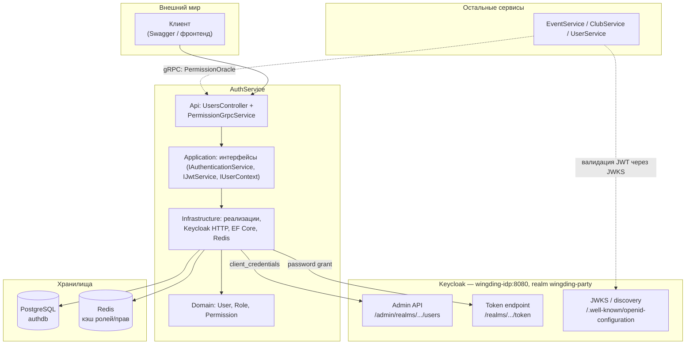
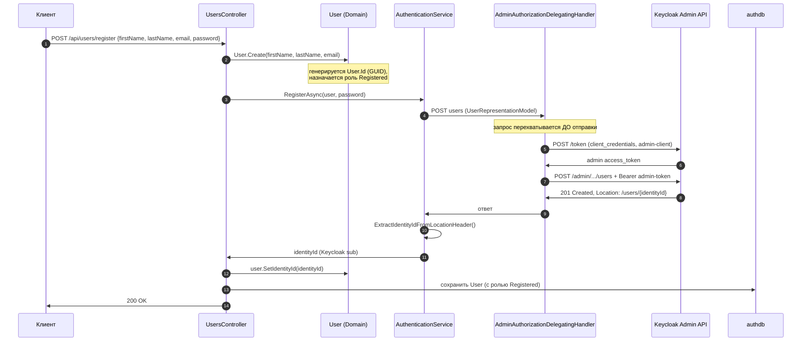
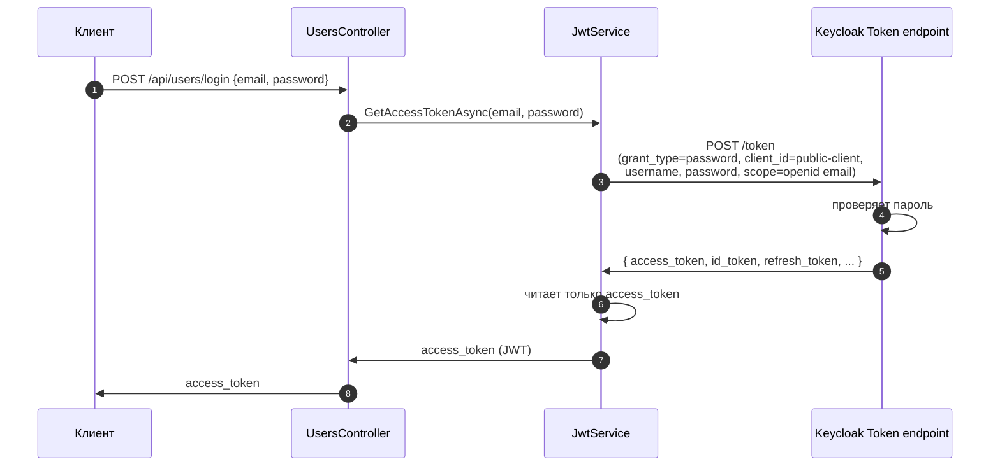
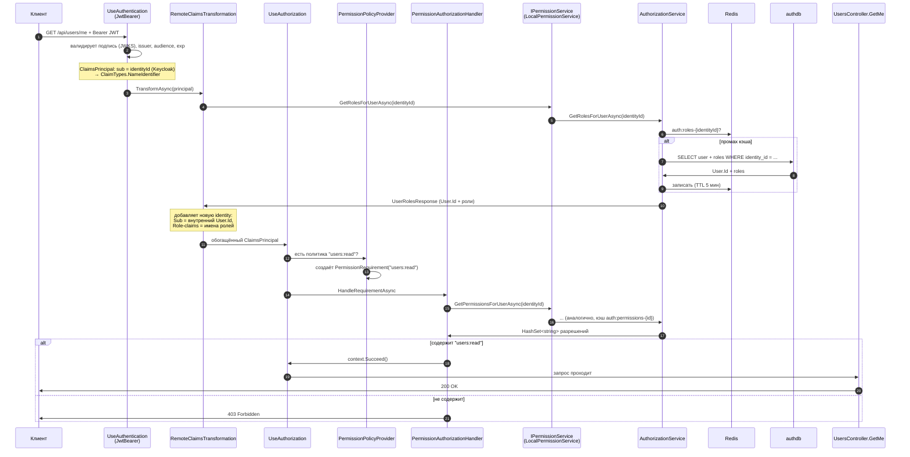
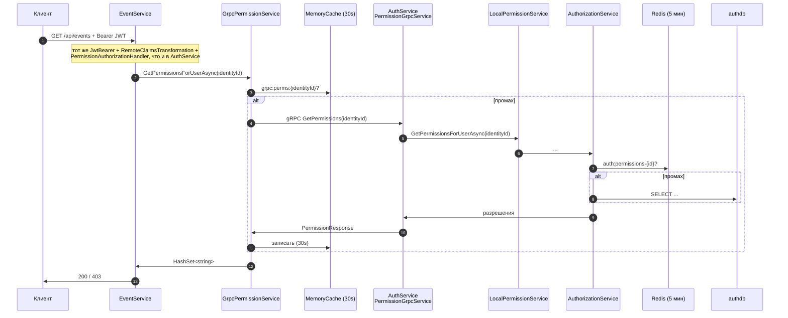
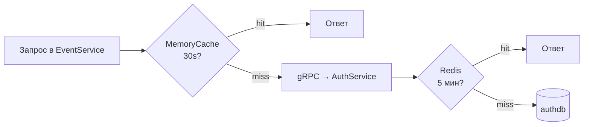
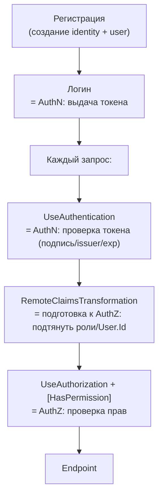

# 01 — Сквозные сценарии AuthService

> Прикладной документ. Здесь — как концепции из [документа 00](00-auth-concepts.md)
> реализованы в коде нашего проекта. Каждый сценарий: текстовое описание → Mermaid-диаграмма
> → разбор «класс A делает X → класс B делает Y» со ссылками на файлы.
>
> Детальный разбор каждого класса по отдельности — в документе 02. Здесь же — **движение по
> цепочке**: что за чем вызывается и какие токены/id где появляются.

---

## 1. Действующие лица в нашем проекте



Две ключевые роли AuthService:

1. **Фасад к Keycloak** — прячет Admin API и token endpoint за чистыми интерфейсами
   (`IAuthenticationService`, `IJwtService`).
2. **Источник истины о правах** — роли и разрешения лежат в `authdb`, и AuthService отдаёт
   их остальным сервисам по gRPC (`PermissionOracle`).

Два важных идентификатора, которые легко перепутать:

| Идентификатор | Что это | Где появляется |
|---|---|---|
| **identityId** | id пользователя **в Keycloak** (claim `sub` в JWT) | возвращается при регистрации, сидит в каждом токене |
| **User.Id** | id пользователя **в нашей БД** (`authdb`), GUID | генерируется при `User.Create()` |

Связь между ними хранится в нашей таблице `users`: поле `IdentityId` (см.
`User.cs:21`, `UserConfiguration.cs:33-38` — уникальный индекс).

---

## 2. Конфигурация: два клиента Keycloak

Прежде чем смотреть потоки, пойми **два разных клиента Keycloak**, которые использует
AuthService (значения — из `appsettings.Development.json` и `docker-compose.yml`):

| Клиент | Тип | Grant | Зачем |
|---|---|---|---|
| `wingding-admin-client` | confidential (с секретом) | `client_credentials` | AuthService от своего имени создаёт пользователей в Keycloak |
| `wingding-public-client` | public | `password` (ROPC) | получить токен пользователя по логину/паролю (dev) |

```jsonc
// appsettings.Development.json
"Keycloak": {
  "AdminUrl":  "http://wingding-idp:8080/admin/realms/wingding-party/",
  "TokenUrl":  "http://wingding-idp:8080/realms/wingding-party/protocol/openid-connect/token",
  "AdminClientId": "wingding-admin-client",
  "AuthClientId":  "wingding-public-client"
},
"Authentication": {
  "Audience":    "account",
  "Issuer":      "http://wingding-idp:8080/realms/wingding-party",
  "MetadataUrl": "http://wingding-idp:8080/realms/wingding-party/.well-known/openid-configuration",
  "RequireHttpsMetadata": false
}
```

`AdminUrl` и `TokenUrl` становятся `BaseAddress` для двух разных `HttpClient` —
см. `Infrastructure/DependencyInjection.cs:62-79`.

---

## 3. Сценарий: регистрация пользователя

**Что происходит концептуально:** мы создаём пользователя в **двух местах** — в Keycloak
(чтобы он умел логиниться) и в нашей БД (чтобы хранить роли/права и профиль). Keycloak —
источник идентичности, наша БД — источник прав.

> ⚠️ Текущее состояние кода: эндпоинт `Register` в `UsersController.cs:19-24` — **заглушка
> (TODO)**. Но вся инфраструктура под ним уже готова и рабочая (`AuthenticationService`,
> `AdminAuthorizationDelegatingHandler`). Ниже описан поток, который собирается из
> существующих кирпичей; «дописать контроллер/команду» — задача из документа 04.



**Разбор по шагам:**

1. **`User.Create(...)`** (`Domain/Entities/User.cs:32-37`) — фабричный метод. Генерирует
   внутренний `User.Id` через `UserId.CreateUnique()` и **сразу выдаёт роль `Registered`**
   (`User.cs:35` → `Role.Create(RoleType.Registered)`). Это доменное правило: «любой
   зарегистрированный пользователь по умолчанию — Registered».

2. **`AuthenticationService.RegisterAsync(...)`** (`Infrastructure/Services/AuthenticationService.cs:17`)
   — собирает `UserRepresentationModel` (формат, который понимает Keycloak Admin API:
   `Common/Dto/UserRepresentationModel.cs`) с вложенным паролем
   (`CredentialRepresentationModel`, `Temporary = false`) и делает `POST users`.
   Обрати внимание: `Username = user.Email` — у нас логин = email.

3. **`AdminAuthorizationDelegatingHandler`** (`Infrastructure/Authentication/AdminAuthorizationDelegatingHandler.cs`)
   — это `DelegatingHandler`, вшитый в `HttpClient` через `.AddHttpMessageHandler<...>()`
   (`Infrastructure/DependencyInjection.cs:71`). Он **перехватывает каждый исходящий запрос**
   к Admin API и:
   - сам идёт в Keycloak token endpoint с `grant_type=client_credentials` от имени
     `wingding-admin-client` (`AdminAuthorizationDelegatingHandler.cs:38-58`),
   - получает админ-токен,
   - вешает его как `Bearer` на исходный запрос (`:29-30`).

   Это и есть **Client Credentials Flow** из документа 00 (раздел 2) — машина-машина, без
   участия пользователя. Прелесть в том, что `AuthenticationService` об этом **ничего не
   знает** — авторизация исходящего запроса полностью скрыта в handler'е.

4. **Возврат identityId.** Keycloak на `201 Created` кладёт URL нового пользователя в заголовок
   `Location: .../users/{id}`. `ExtractIdentityIdFromLocationHeader`
   (`AuthenticationService.cs:45-54`) парсит оттуда `identityId`. Это и есть будущий `sub`.

5. **Связывание.** `user.SetIdentityId(identityId)` (`User.cs:44`) проставляет связь, после
   чего `User` сохраняется в `authdb`. Теперь по `identityId` из любого токена мы найдём
   нашего пользователя и его роли.

**Что родилось в этом сценарии:**

| Артефакт | Кто создал | Где живёт |
|---|---|---|
| `User.Id` (GUID) | `User.Create()` | `authdb.users` |
| роль `Registered` | `User.Create()` | `authdb.user_roles` |
| identityId (`sub`) | Keycloak | Keycloak + `authdb.users.identity_id` |
| admin access_token | Keycloak (client_credentials) | в памяти handler'а, недолго |

---

## 4. Сценарий: логин (получение токена)

**Концептуально:** пользователь меняет логин/пароль на access token. В нашем dev-коде это
**ROPC** (Resource Owner Password Credentials) — клиент шлёт пароль на AuthService, тот
пробрасывает его в Keycloak. В проде это должно стать Authorization Code Flow + PKCE
(документ 00, раздел 4; документ 04 — план).

> ⚠️ `Login` в `UsersController.cs:26-31` — тоже **заглушка (TODO)**. Рабочая механика — в
> `JwtService`.



**Разбор:**

- **`JwtService.GetAccessTokenAsync(...)`** (`Infrastructure/Services/JwtService.cs:24-45`)
  собирает `application/x-www-form-urlencoded` тело с `grant_type=password`, `client_id =
  wingding-public-client`, логином и паролем, `scope = "openid email"`. Шлёт на `TokenUrl`
  (он же `BaseAddress` этого `HttpClient`).
- Keycloak проверяет пароль и возвращает JSON с токенами. Десериализация — в
  `AuthorizationToken` (`Common/Dto/AuthenticationToken.cs`), но из него читается **только**
  `access_token` (`JwtService.cs:43-44`). `id_token` и `refresh_token` сейчас отбрасываются.
- При неуспехе (`:40-41`) возвращается `null`.

> 🔎 **Почему в комментарии к коду написано «ONLY for development»** (`JwtService.cs:20-23`):
> при ROPC пароль проходит через наш сервис — мы его видим. Это противоречит главной идее
> OAuth («приложение не должно видеть пароль»). Для прода нужен redirect-поток (PKCE), где
> пароль вводится только на странице Keycloak.

**Что родилось:** access token (JWT, подписан realm-ключом Keycloak). Дальше клиент
прикладывает его как `Bearer` к каждому запросу.

---

## 5. Сценарий: запрос к защищённому эндпоинту (сердце системы)

Это самый важный сценарий — он связывает **аутентификацию** (проверка токена) и
**авторизацию** (проверка прав). Пример: `GET /api/users/me` с атрибутом
`[HasPermission(Permissions.UsersRead)]` (`UsersController.cs:33-39`).

Порядок задаётся в `Program.cs:24-25`:

```csharp
app.UseAuthentication();  // 1) кто ты? — валидация JWT
app.UseAuthorization();   // 2) что тебе можно? — проверка permission
```



**Разбор по фазам:**

### Фаза 1 — Аутентификация (`UseAuthentication`)

- JwtBearer-middleware валидирует токен по правилам из **`JwtBearerOptionsSetup`**
  (`Infrastructure/Authentication/JwtBearerOptionsSetup.cs`): `Audience`, `Issuer`,
  `MetadataAddress` (откуда тянутся публичные ключи JWKS — см. документ 00, раздел 5).
  Регистрация — `Infrastructure/DependencyInjection.cs:47-53`.
- Если подпись/issuer/audience/срок ок — собирается `ClaimsPrincipal`. Keycloak'овский `sub`
  по умолчанию маппится в claim `ClaimTypes.NameIdentifier`. **Это наш identityId.**
- На этом этапе мы знаем только, что токен подлинный и кому он выдан в Keycloak. Про наши
  роли/права токен ничего не несёт.

### Фаза 1.5 — Обогащение claims (`IClaimsTransformation`)

- **`RemoteClaimsTransformation`** (`SharedKernel/.../Authorization/RemoteClaimsTransformation.cs`)
  запускается ASP.NET автоматически после аутентификации. Берёт `identityId`
  (`ClaimTypes.NameIdentifier`, `:30`) и через `IPermissionService.GetRolesForUserAsync`
  тянет из нашей БД внутренний `User.Id` и роли.
- Затем **добавляет новую identity** в principal (`:35-44`): claim `Sub` = внутренний
  `User.Id`, и по claim `Role` на каждую роль.
- Зачем подменять `Sub`? Чтобы прикладной код работал с **нашим** идентификатором
  пользователя, а не с Keycloak'овским. Именно это читают расширения
  `ClaimsPrincipalExtensions` (`Infrastructure/Common/Extensions/`):
  - `GetUserId()` → `JwtRegisteredClaimNames.Sub` = внутренний User.Id;
  - `GetIdentityId()` → `ClaimTypes.NameIdentifier` = Keycloak identityId.
  Их использует `UserContext` (`Infrastructure/Authentication/UserContext.cs`) — удобный
  доступ к «кто сейчас в запросе».
- Оптимизация: если в principal уже есть и `Role`, и `Sub` — трансформация выходит сразу
  (`RemoteClaimsTransformation.cs:19-24`), чтобы не дёргать БД повторно.

### Фаза 2 — Авторизация (`UseAuthorization`)

- Атрибут **`[HasPermission("users:read")]`** (`SharedKernel/.../HasPermissionAttribute.cs`) —
  это наследник `AuthorizeAttribute`, который кладёт строку разрешения в `Policy`.
- **`PermissionAuthorizationPolicyProvider`** (`SharedKernel/.../PermissionAuthorizationPolicyProvider.cs`):
  ASP.NET спрашивает «есть политика `users:read`?». Заранее её нет, поэтому провайдер
  **создаёт её на лету** — политику с одним требованием `PermissionRequirement("users:read")`
  — и кэширует (`:32-37`).
- **`PermissionAuthorizationHandler`** (`SharedKernel/.../PermissionAuthorizationHandler.cs`)
  проверяет требование: берёт `identityId`, через `IPermissionService.GetPermissionsForUserAsync`
  получает множество разрешений и проверяет `permissions.Contains("users:read")` (`:35-38`).
  Если да — `context.Succeed(requirement)`, запрос проходит. Если нет — 403.

### Кто такой `IPermissionService` здесь

В **самом AuthService** `IPermissionService` = **`LocalPermissionService`**
(`Infrastructure/Authorization/LocalPermissionService.cs`, регистрация —
`Infrastructure/DependencyInjection.cs:40`). Он ходит **напрямую в БД** через
**`AuthorizationService`** (`Infrastructure/Authorization/AuthorizationService.cs`):

- `GetRolesForUserAsync` / `GetPermissionsForUserAsync` сначала смотрят в **Redis**
  (`auth:roles-{identityId}` / `auth:permissions-{identityId}`, TTL 5 минут), при промахе —
  запрос в Postgres через `IDbContextFactory<AuthDbContext>` и запись в кэш
  (`AuthorizationService.cs:27-75`).

Почему `IDbContextFactory`, а не обычный `DbContext`? Потому что `IClaimsTransformation` и
authorization handlers могут вызываться вне scope'а запроса / параллельно, и фабрика даёт
свежий контекст на каждый вызов (комментарий в `AuthorizationService.cs:10-14`).

> 🔑 **Главный вывод сценария:** токен Keycloak отвечает только на вопрос «кто ты»
> (аутентификация). На вопрос «что тебе можно» (авторизация) отвечает **наша БД**, а её
> данные «вклеиваются» в запрос механизмом `IClaimsTransformation`. Поэтому смена прав
> применяется почти мгновенно (максимум через TTL кэша), не дожидаясь истечения токена.

---

## 6. Сценарий: авторизация в *других* сервисах (gRPC)

EventService/ClubService/UserService не имеют доступа к `authdb` — её владелец AuthService.
Когда такому сервису нужно узнать права пользователя, он **спрашивает AuthService по gRPC**.

Магия в том, что код проверки прав (`RemoteClaimsTransformation`,
`PermissionAuthorizationHandler`) — **тот же самый**, общий, лежит в SharedKernel. Меняется
только реализация `IPermissionService`:

- в AuthService — `LocalPermissionService` (БД напрямую);
- в остальных — **`GrpcPermissionService`** (`SharedKernel/.../Services/GrpcPermissionService.cs`).

Выбор задаётся при регистрации: downstream-сервисы вызывают `AddWingDingAuthRemote`
(`SharedKernel/.../DependencyInjection.cs:37-64`), который регистрирует JWT-валидацию,
gRPC-клиент и `GrpcPermissionService`. AuthService вызывает `AddWingDingAuthCore` +
свой `LocalPermissionService`.



**Разбор:**

- **gRPC-контракт** описан в `SharedKernel/.../Protos/authorization.proto` — сервис
  `PermissionOracle` с двумя методами: `GetPermissions` и `GetRoles`. Обмен — Protobuf по
  HTTP/2 (компактнее и быстрее JSON).
- **Серверная сторона** в AuthService — `PermissionGrpcService`
  (`Api/gRPC/Services/PermissionGrpcService.cs`), смонтирован в `Program.cs:31`
  (`MapGrpcService<PermissionGrpcService>()`). Внутри он зовёт тот же `IPermissionService`
  (= `LocalPermissionService` → `AuthorizationService` → Redis/БД).
- **Клиентская сторона** — `GrpcPermissionService` со своим **in-memory кэшем (30 секунд)**.
- Итого получается **два слоя кэша**: 30 секунд in-memory в вызывающем сервисе + 5 минут
  Redis в AuthService. Это снимает нагрузку с БД при большом потоке запросов.



---

## 7. Полная карта токенов, ключей и идентификаторов

Сводка «что, кем, откуда, куда, зачем» — то, что ты просил.

| Артефакт | Кто выпускает | Где появляется | Куда передаётся | Зачем |
|---|---|---|---|---|
| **admin access_token** | Keycloak (client_credentials, `wingding-admin-client`) | `AdminAuthorizationDelegatingHandler` | в заголовок запроса к Admin API | дать AuthService право создавать пользователей |
| **user access_token (JWT)** | Keycloak (password grant, `wingding-public-client`) | `JwtService` → клиент | как `Bearer` в каждый запрос к API | аутентификация пользователя |
| **realm signing key (RSA)** | Keycloak | внутри Keycloak | публичная часть — через JWKS | подпись и проверка JWT |
| **JWKS (публичные ключи)** | Keycloak | JWKS endpoint | скачивается каждым сервисом, кэшируется | проверка подписи токена без обращения к Keycloak |
| **identityId (`sub`)** | Keycloak (при регистрации) | `Location`-заголовок → `authdb` | в каждом JWT; ключ поиска в БД | связать токен с нашим пользователем |
| **User.Id (GUID)** | `User.Create()` | `authdb.users` | подменяется в `Sub`-claim через `RemoteClaimsTransformation` | внутренний идентификатор для прикладного кода |
| **роли/разрешения** | сидинг в `RoleConfiguration` | `authdb` | в `ClaimsPrincipal` (claims) и по gRPC | авторизация (проверка прав) |

---

## 8. Когда именно происходит AuthN и когда AuthZ



- **Аутентификация** (кто ты): один раз при логине (выдача токена) + на каждом запросе
  быстрая проверка подписи токена. Источник истины — **Keycloak**.
- **Авторизация** (что можно): на каждом защищённом запросе, через `[HasPermission]`.
  Источник истины — **`authdb` AuthService**.

---

## 9. Сводка ролей и разрешений (что куда)

Дефолтная матрица прав зашита в сидинге `RoleConfiguration.cs:63-96`. Полезно держать перед
глазами:

| Роль | Разрешения |
|---|---|
| **Guest** | `events:read`, `clubs:read` |
| **Registered** | `events:read`, `clubs:read`, `users:read` |
| **Moderator** | + `events:create/update`, `clubs:create/update`, `users:update` |
| **Admin** | все разрешения, включая `events:delete`, `clubs:delete`, `admin:panel` |

Сами разрешения определены типобезопасно как `Permission : Enumeration`
(`Domain/Enumerations/Permission.cs`), а их строковые константы для атрибутов —
в `Contracts/Constants/Permissions.cs`. Связь «роль → разрешения» — таблица `role_permissions`
(сидинг там же). Новый пользователь получает роль `Registered` автоматически (`User.cs:35`).

---

➡️ Дальше: [02 — Справочник по классам](02-class-reference.md) — построчный разбор каждого
класса по слоям. Здесь мы прошли «по горизонтали» (по потокам); там пойдём «по вертикали»
(по слоям и файлам).
