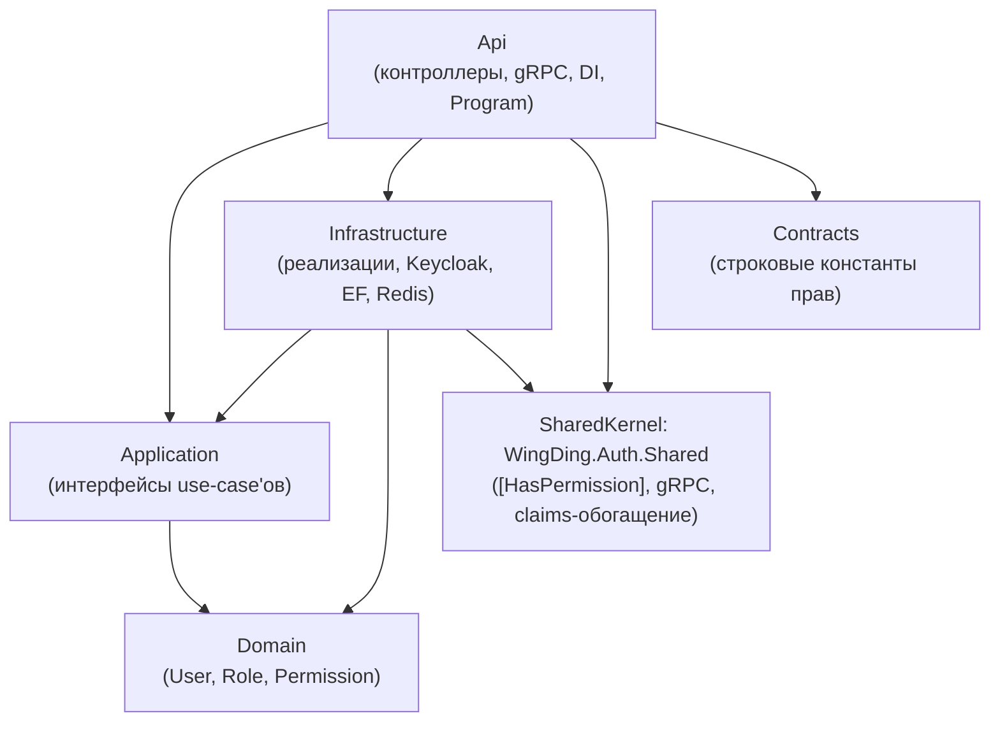
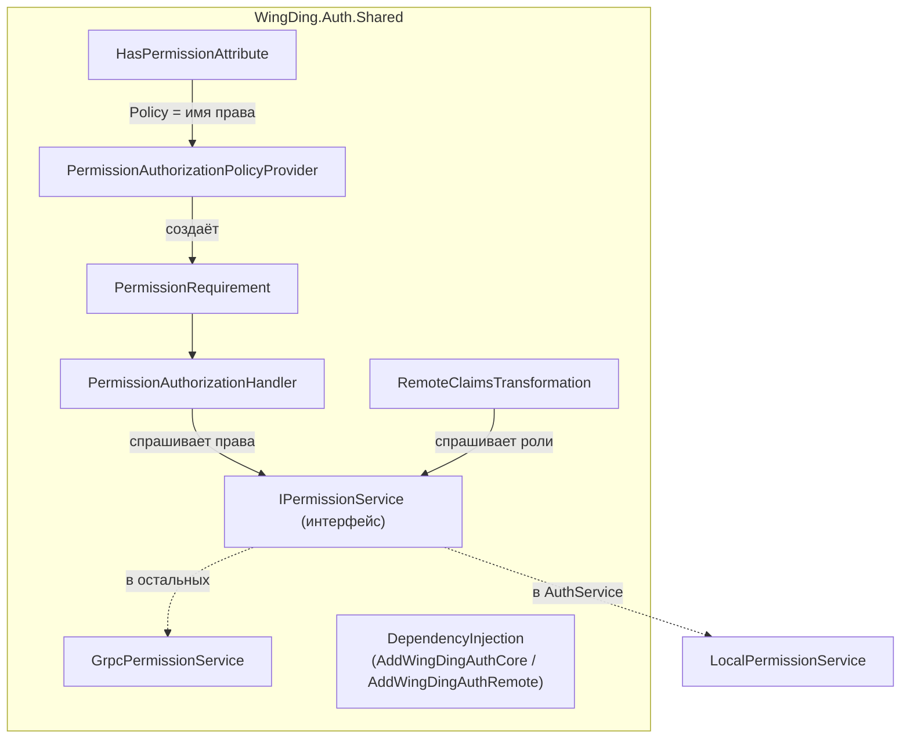

# 02 — Справочник по классам AuthService

> Прикладной документ-справочник. В [документе 01](01-authservice-flows.md) мы шли «по
> горизонтали» (по сценариям). Здесь идём «по вертикали» — по слоям Clean Architecture,
> разбирая **каждый класс**: зачем он, за что отвечает, ключевые члены, с кем связан, где
> участвует в потоке.
>
> Используй как настольный справочник: нашёл класс — прочитал карточку. Карточки внутри слоя
> отсортированы от фундамента к использованию.

## Карта зависимостей слоёв

Правило зависимостей (Clean Architecture): стрелки идут **внутрь**, к Domain. Domain не
зависит ни от чего. Application зависит только от Domain. Infrastructure и Api — внешние
кольца, они реализуют интерфейсы внутренних.

Содержание:
- [Domain](#domain) — сущности и базовые абстракции
- [Application](#application) — интерфейсы use-case'ов
- [Contracts](#contracts) — общие константы
- [Infrastructure](#infrastructure) — реализации, внешние системы
- [Api](#api) — точка входа, контроллеры, gRPC
- [SharedKernel (WingDing.Auth.Shared)](#sharedkernel-wingdingauthshared) — общий слой авторизации

---

## Domain

Слой без внешних зависимостей. Здесь — бизнес-сущности и DDD-абстракции. Если хочешь понять
«из чего вообще состоит пользователь и его права» — начинай отсюда.

### `Entity<TId>` — базовый класс сущностей
`Domain/Common/Abstractions/Entity.cs`

- **Зачем.** Базовый класс для всех сущностей с **identity-based equality**: две сущности
  равны, если равны их `Id`, а не если совпадают все поля. Это краеугольный камень DDD —
  сущность остаётся «той же самой» даже если её свойства изменились.
- **Ключевое.** Дженерик-параметр `TId` (`where TId : notnull`) позволяет использовать
  строго типизированные идентификаторы (`UserId`, `RoleId`) вместо «голых» `Guid`/`int`.
  Переопределены `Equals`, `GetHashCode`, операторы `==`/`!=` — все через `Id`.
- **Нюанс.** Защищённый пустой конструктор `protected Entity()` нужен EF Core для
  материализации из БД (поэтому `#pragma warning disable CS8618` — подавление
  предупреждения о неинициализированном `Id`).
- **Кто наследует.** `User`, `Role`.

### `ValueObject` — базовый класс объектов-значений
`Domain/Common/Abstractions/ValueObject.cs`

- **Зачем.** Базовый класс для **value objects** — объектов без собственной идентичности,
  равенство которых определяется **по значению всех компонентов**. `UserId` с одним и тем же
  `Guid` всегда равен другому такому же.
- **Ключевое.** Абстрактный метод `GetEqualityComponents()` — наследник перечисляет поля,
  участвующие в сравнении. `Equals` сверяет их через `SequenceEqual`, `GetHashCode` —
  XOR-свёрткой хэшей компонентов.
- **Кто наследует.** `UserId`, `RoleId`, `RolePermission`.

### `Enumeration` — типобезопасные перечисления
`Domain/Common/Abstractions/Enumeration.cs`

- **Зачем.** Замена обычному `enum`. Каждый элемент — это объект с `Id`, `Name`,
  `Description`, который можно расширять поведением и хранить в БД по имени/id. Решает
  проблему «магических чисел» и даёт удобный поиск.
- **Ключевые члены.**
  - `GetAll<T>()` — через рефлексию возвращает все `public static` поля типа (так
    собираются все разрешения/роли).
  - `GetFromId<T>(int)` / `GetFromName<T>(string)` — поиск элемента; бросает
    `ApplicationException`, если не найден.
  - `Equals`/`GetHashCode`/`CompareTo` — равенство по паре (тип + `Id`).
- **Кто наследует.** `Permission`, `RoleType`.
- **Где используется.** `RoleConfiguration` хранит `RoleType` в БД по имени и восстанавливает
  через `Enumeration.GetFromName<RoleType>(...)` (`RoleConfiguration.cs:24-26`).

### `User` — пользователь (агрегат)
`Domain/Entities/User.cs`

- **Зачем.** Центральная сущность. Представляет нашего пользователя в `authdb` и связывает
  его с идентичностью в Keycloak.
- **Ключевые свойства.**
  - `Id : UserId` — внутренний идентификатор (GUID).
  - `IdentityId : string` — **Keycloak `sub`**, связь с идентичностью в IdP (`User.cs:21`).
  - `FirstName`, `LastName`, `Email` — профиль; сеттеры приватные (инкапсуляция).
  - `Roles : IReadOnlyCollection<Role>` — роли; наружу отдаётся копия, внутреннее поле
    `_roles` приватное (нельзя менять коллекцию в обход методов).
- **Поведение.**
  - `Create(firstName, lastName, email)` — фабрика. Генерирует `UserId.CreateUnique()` и
    **сразу выдаёт роль `Registered`** (`User.cs:35`). Доменное правило.
  - `AddRole(role)`, `SetIdentityId(identityId)` — контролируемые изменения состояния.
  - Два приватных конструктора: пустой — для EF, с параметрами — для фабрики.
- **Где участвует.** Создаётся при регистрации (сценарий 3 в документе 01), читается при
  обогащении claims и проверке прав.

### `Role` — роль (группа разрешений)
`Domain/Entities/Role.cs`

- **Зачем.** Роль связывает пользователей и набор разрешений. Реализует RBAC-уровень
  (документ 00, раздел 6).
- **Ключевые свойства.** `RoleType : RoleType` (какая именно роль), `Permissions`,
  `Users` — обе наружу отдаются копиями, внутренние списки приватные.
- **Поведение.** Фабрика `Create(RoleType)`; конструкторы приватные.
- **Нюанс.** Сами объекты `Role` (записи в таблице `roles`) и привязка разрешений
  (`role_permissions`) **сидятся миграцией** — см. `RoleConfiguration`. В рантайме роли не
  создаются произвольно.

### `Permission` — разрешение
`Domain/Enumerations/Permission.cs`

- **Зачем.** Конкретное право (`events:create`, `users:read`, ...). Наследник `Enumeration`,
  то есть типобезопасный «перечень» с `Id` и строковым `Name`.
- **Ключевое.** 11 статических полей — полный список разрешений системы
  (`Permission.cs:9-25`). Группированы по сервисам (Event/User/Club) + `AdminPanel`.
  `Name` (`"events:create"`) — то самое значение, которое проверяет
  `PermissionAuthorizationHandler` и которое прописывается в `[HasPermission(...)]`.
- **Связь.** Строковые дубликаты этих имён лежат в `Contracts/Constants/Permissions.cs` —
  чтобы атрибуты можно было ставить, не ссылаясь на Domain.

### `RoleType` — вид роли
`Domain/Enumerations/RoleType.cs`

- **Зачем.** Перечень ролей: `Guest`, `Registered`, `Moderator`, `Admin`
  (`RoleType.cs:8-11`). Тоже `Enumeration`.
- **Где.** `Role.RoleType` хранит его; `User.Create` назначает `RoleType.Registered`;
  сидинг в `RoleConfiguration` раздаёт каждой роли её разрешения.

### `UserId`, `RoleId` — строго типизированные идентификаторы
`Domain/ValueObjects/Ids/UserId.cs`, `Domain/ValueObjects/Ids/RoleId.cs`

- **Зачем.** Чтобы нельзя было случайно передать `RoleId` туда, где ждут `UserId` —
  компилятор не даст. Это защита от целого класса багов с перепутанными id.
- **Ключевое.** `UserId` оборачивает `Guid` (`Create(guid)`, `CreateUnique()`); `RoleId`
  оборачивает `int` (`Create(int)`). Оба — `ValueObject`, равенство по `Value`.
- **Где.** EF конвертирует их в примитивы при сохранении и обратно — см. `HasConversion` в
  `UserConfiguration.cs:15-16` и `RoleConfiguration.cs:18-22`.

### `RolePermission` — связка роль↔разрешение
`Domain/ValueObjects/RolePermission.cs`

- **Зачем.** Представляет строку join-таблицы `role_permissions` (`RoleId` + `PermissionId`).
  Сделан `ValueObject` с равенством по обоим полям.
- **Где.** Используется как явная entity для many-to-many в `RoleConfiguration.cs:36-46`, и
  туда же сидятся дефолтные привязки (`DefaultRolePermissions`).

---

## Application

Слой use-case'ов. Здесь — **только интерфейсы** (контракты), без реализаций. Реализуются они
в Infrastructure. Это и есть «инверсия зависимостей»: Application говорит «мне нужен сервис,
который умеет X», а *как* — решает внешний слой.

> Сейчас слой минимален: три интерфейса и пустой `AddApplication()`. CQRS-команды
> (MediatR-хендлеры для Register/Login) ещё не написаны — это задача из документа 04.

### `IAuthenticationService` — контракт регистрации
`Application/Services/IAuthenticationService.cs`

- **Зачем.** Абстракция «зарегистрировать пользователя во внешнем IdP».
- **Контракт.** `Task<string> RegisterAsync(User user, string password, ct)` — принимает
  доменного `User`, возвращает `identityId` (Keycloak `sub`).
- **Реализация.** `Infrastructure/Services/AuthenticationService.cs`.

### `IJwtService` — контракт получения токена
`Application/Services/IJwtService.cs`

- **Зачем.** Абстракция «получить access token по логину/паролю».
- **Контракт.** `Task<string?> GetAccessTokenAsync(string email, string password, ct)` —
  `null` при неуспехе.
- **Реализация.** `Infrastructure/Services/JwtService.cs` (ROPC, dev-only).

### `IUserContext` — кто сейчас в запросе
`Application/Common/Interfaces/IUserContext.cs`

- **Зачем.** Дать прикладному коду доступ к текущему пользователю, не таская
  `HttpContext`/`ClaimsPrincipal` по слоям.
- **Контракт.** `Guid UserId` (внутренний) и `string IdentityId` (Keycloak).
- **Реализация.** `Infrastructure/Authentication/UserContext.cs`.

---

## Contracts

Слой общих DTO/констант для межсервисной коммуникации и атрибутов.

### `Permissions` — строковые константы прав
`Contracts/Constants/Permissions.cs`

- **Зачем.** Те же значения, что и `Permission.Name` в Domain, но как `const string`. Нужны,
  чтобы ставить `[HasPermission(Permissions.UsersRead)]`, **не завязываясь на Domain-слой**
  (атрибут — в Api, ему нельзя тянуть Domain).
- **Нюанс / риск.** Это **ручная дубликация** строк из `Permission.cs`. Если добавишь
  разрешение в `Permission`, не забудь добавить и сюда — иначе атрибут будет некуда сослаться.
  (Кандидат на автогенерацию — отметка для документа 04.)

---

## Infrastructure

Самый «толстый» слой. Реализации интерфейсов, интеграция с Keycloak, EF Core, Redis,
конфигурация. Сгруппирован по папкам.

### Services — фасады к Keycloak

#### `AuthenticationService` — регистрация через Keycloak Admin API
`Infrastructure/Services/AuthenticationService.cs`

- **Зачем.** Реализует `IAuthenticationService`. Создаёт пользователя в Keycloak.
- **Как.** Собирает `UserRepresentationModel` (с `Username = Email` и вложенным паролем),
  делает `POST users` на Admin API (`BaseAddress` = `AdminUrl`). Из `Location`-заголовка
  ответа `201` парсит `identityId` (`ExtractIdentityIdFromLocationHeader`, `:45-54`).
- **Важно.** Сам **не занимается авторизацией** исходящего запроса — за это отвечает
  `AdminAuthorizationDelegatingHandler`, вшитый в его `HttpClient`. Класс об этом не знает.
- **Видимость.** `internal sealed` — наружу торчит только интерфейс.

#### `JwtService` — получение токена через token endpoint
`Infrastructure/Services/JwtService.cs`

- **Зачем.** Реализует `IJwtService`. Меняет логин/пароль на access token.
- **Как.** `POST` form-urlencoded с `grant_type=password`, `client_id=wingding-public-client`,
  `scope=openid email` на `TokenUrl`. Из JSON-ответа (`AuthorizationToken`) берёт только
  `access_token`.
- **⚠️ Ограничение.** ROPC — **только для dev** (комментарий `:20-23`). Прод → PKCE.
- **Зависимости.** `KeycloakOptions` (через `IOptions`).

### Authentication — валидация токена и контекст

#### `JwtBearerOptionsSetup` — настройка валидации JWT
`Infrastructure/Authentication/JwtBearerOptionsSetup.cs`

- **Зачем.** Конфигурирует, как middleware проверяет входящие токены. Реализует
  `IConfigureNamedOptions<JwtBearerOptions>` — паттерн «отложенной» настройки опций из DI.
- **Что задаёт.** `Audience`, `MetadataAddress` (→ откуда тянуть JWKS/discovery),
  `RequireHttpsMetadata`, `ValidIssuer` — всё из `AuthenticationOptions`.
- **Где включается.** `ConfigureOptions<JwtBearerOptionsSetup>()` в
  `Infrastructure/DependencyInjection.cs:53`.

#### `AdminAuthorizationDelegatingHandler` — авто-Bearer для Admin API
`Infrastructure/Authentication/AdminAuthorizationDelegatingHandler.cs`

- **Зачем.** `DelegatingHandler`, который прозрачно добавляет admin-токен ко всем исходящим
  запросам к Keycloak Admin API.
- **Как.** Перед отправкой получает токен по `client_credentials` (`wingding-admin-client`,
  `:38-58`) и вешает `Authorization: Bearer` (`:29-30`). После ответа —
  `EnsureSuccessStatusCode()`.
- **Где вшит.** `AddHttpMessageHandler<AdminAuthorizationDelegatingHandler>()` на
  `HttpClient` для `AuthenticationService` (`DependencyInjection.cs:71`).
- **Это пример** Client Credentials Flow (документ 00, раздел 2).

#### `UserContext` — реализация «кто в запросе»
`Infrastructure/Authentication/UserContext.cs`

- **Зачем.** Реализует `IUserContext` поверх `IHttpContextAccessor`.
- **Как.** `UserId` → `HttpContext.User.GetUserId()`, `IdentityId` →
  `...GetIdentityId()` (расширения из `ClaimsPrincipalExtensions`). Если контекста нет —
  `ApplicationException`.

#### `ClaimsPrincipalExtensions` — извлечение id из claims
`Infrastructure/Common/Extensions/ClaimsPrincipalExtensions.cs`

- **Зачем.** Два метода-расширения, инкапсулирующих «из какого claim какой id брать».
- **Ключевое (важно не перепутать!):**
  - `GetUserId()` → `JwtRegisteredClaimNames.Sub` = **внутренний** `User.Id` (его туда
    кладёт `RemoteClaimsTransformation`).
  - `GetIdentityId()` → `ClaimTypes.NameIdentifier` = **Keycloak** `sub`.
- **Где.** Используется `UserContext`.

### Authorization — права из БД

#### `AuthorizationService` — чтение прав из БД + кэш
`Infrastructure/Authorization/AuthorizationService.cs`

- **Зачем.** Источник истины о ролях/разрешениях: читает их из `authdb`, кэширует в Redis.
- **Методы.**
  - `GetRolesForUserAsync(identityId)` → `UserRolesResponse` (внутренний `User.Id` + роли).
  - `GetPermissionsForUserAsync(identityId)` → `HashSet<string>` имён разрешений.
- **Кэш.** Redis-ключи `auth:roles-{identityId}` и `auth:permissions-{identityId}`, TTL 5 мин
  (`CacheExpiration`). Сначала проверяется кэш, при промахе — БД, потом запись в кэш.
- **Нюанс.** Использует `IDbContextFactory<AuthDbContext>`, а не обычный `DbContext` —
  потому что вызывается из `IClaimsTransformation`/authorization-хендлеров, которые могут
  работать вне scope запроса / параллельно (комментарий `:10-14`).
- **Видимость.** `public sealed` (зовётся из `LocalPermissionService` и регистрируется в DI).

#### `LocalPermissionService` — реализация `IPermissionService` для AuthService
`Infrastructure/Authorization/LocalPermissionService.cs`

- **Зачем.** Версия `IPermissionService` (контракт из SharedKernel), которая ходит **в БД
  напрямую** через `AuthorizationService`. Используется **только в самом AuthService**,
  потому что он — владелец `authdb`.
- **Как.** Делегирует в `AuthorizationService`; в `GetRolesForUserAsync` мапит
  `UserRolesResponse` → `UserRolesDto` (контракт SharedKernel), вытаскивая имена ролей
  (`RoleType.Name`).
- **Контраст.** В остальных сервисах тот же `IPermissionService` = `GrpcPermissionService`.

#### `UserRolesResponse` — внутренний DTO ролей
`Infrastructure/Authorization/UserRolesResponse.cs` *(имя файла в репозитории —
`UserRolesREsponse.cs`, опечатка в названии файла; класс называется корректно)*

- **Зачем.** Результат `AuthorizationService.GetRolesForUserAsync`: `Guid UserId` +
  `List<Role>`. Сериализуется в Redis и мапится в `UserRolesDto` для внешнего мира.

### Persistence — EF Core

#### `AuthDbContext` — контекст БД
`Infrastructure/Persistence/AuthDbContext.cs`

- **Зачем.** EF Core-контекст. `DbSet`'ы: `Users`, `Roles`, `Permissions`, `RolePermissions`.
- **Как.** `OnModelCreating` подхватывает все `IEntityTypeConfiguration` из сборки
  (`ApplyConfigurationsFromAssembly`). Регистрируется как **фабрика**
  (`AddDbContextFactory`, `DependencyInjection.cs:100-113`) с Npgsql, retry-on-failure(2) и
  snake_case-именованием.

#### `UserConfiguration` / `RoleConfiguration` / `PermissionConfiguration`
`Infrastructure/Persistence/ModelsConfiguration/*.cs`

- **`UserConfiguration`** — таблица `users`; конвертация `UserId`↔`Guid`; уникальные
  индексы на `Email` и `IdentityId`; навигация `Roles` через backing-field `_roles`.
- **`RoleConfiguration`** — таблица `roles`; `RoleType` хранится по `Name`; many-to-many
  `Role↔User` (таблица `user_roles`) и `Role↔Permission` (таблица `role_permissions` через
  `RolePermission`). **Сидинг**: 4 роли + дефолтная матрица `DefaultRolePermissions`
  (`:63-96`) — та самая таблица прав из документа 01, раздел 9.
- **`PermissionConfiguration`** — таблица `permissions`; сидит все 11 разрешений из
  `Permission`.

#### Миграции
`Infrastructure/Persistence/Migrations/*`

- `20260601084039_InitialCreate_WithRolesAndPermissions` — начальная схема + сид-данные
  (роли, разрешения, привязки). Применяются автоматически при старте через `ApplyMigrations()`
  (`DependencyInjection.cs:144-151`, вызывается в `Program.cs:27`).

### Common/Configuration — опции

| Класс | Файл | Что биндит |
|---|---|---|
| `KeycloakOptions` | `Common/Configuration/KeycloackOptions.cs` | URL'ы Keycloak + id/секреты двух клиентов |
| `AuthenticationOptions` | `Common/Configuration/AuthenticationOptions.cs` | `Audience`, `Issuer`, `MetadataUrl`, `RequireHttpsMetadata` для валидации JWT |
| `AuthDatabaseOptions` | `Common/Configuration/AuthDatabaseOptions.cs` | строка подключения к Postgres |
| `RedisOptions` | `Common/Configuration/RedisOptions.cs` | строка подключения к Redis |

- **Где биндятся.** Часть — на root configuration в `Api/DependencyInjection.cs:53-55`;
  `Authentication` и `Keycloak` — явно через `GetSection(...)` в
  `Infrastructure/DependencyInjection.cs:52-55`.

### Common/Dto — модели обмена с Keycloak

| Класс | Файл | Назначение |
|---|---|---|
| `UserRepresentationModel` | `Common/Dto/UserRepresentationModel.cs` | тело `POST` в Admin API: профиль + `credentials` |
| `CredentialRepresentationModel` | `Common/Dto/CredentialRepresentationModel.cs` | пароль (`type=password`, `temporary=false`) |
| `AuthorizationToken` | `Common/Dto/AuthenticationToken.cs` | разбор ответа token endpoint; читается только `access_token` |

> Имя класса `AuthorizationToken` лежит в файле `AuthenticationToken.cs` — мелкое
> расхождение имени файла и класса, на работу не влияет.

### `Infrastructure/DependencyInjection.cs` — сборка слоя

- **`AddInfrastructure`** — корневой метод: `RegisterDbContext` → `RegisterRedis` →
  `AddAuthentication` → `AddAuthorization` → `AddHttpClients`.
- **`AddAuthentication`** (`:45-60`) — JwtBearer-схема, `JwtBearerOptionsSetup`, опции
  Keycloak, регистрация `AdminAuthorizationDelegatingHandler` и `IUserContext`.
- **`AddAuthorization`** (`:37-43`) — `AuthorizationService`, `LocalPermissionService` как
  `IPermissionService`, и **`AddWingDingAuthCore()`** (подключение общего слоя из SharedKernel).
- **`AddHttpClients`** (`:62-84`) — два типизированных `HttpClient`: для Admin API (с
  delegating-handler) и для token endpoint.
- **`ApplyMigrations`** (`:144-151`) — применение миграций на старте.

---

## Api

Точка входа (presentation). Контроллеры, gRPC-сервис, DI presentation-слоя, конвейер
middleware.

### `Program.cs` — конвейер приложения
`Api/Program.cs`

- **Сборка DI** (`:8-12`): `AddPresentation` → `AddInfrastructure` → `AddApplication`.
- **Middleware-конвейер** (`:16-32`): Swagger (в dev) → **`UseAuthentication`** →
  **`UseAuthorization`** → `ApplyMigrations` → HTTPS-redirect → exception handler →
  `MapControllers` → `MapGrpcService<PermissionGrpcService>`.
- **Важно.** Порядок `UseAuthentication` **перед** `UseAuthorization` критичен — сначала «кто
  ты», потом «что можно» (документ 01, раздел 5).

### `UsersController` — HTTP-эндпоинты
`Api/Controllers/UsersController.cs`

- **Зависимости.** `ISender` (MediatR) + `IMapper` (Mapster) — заготовка под CQRS.
- **Эндпоинты.**
  - `POST /api/users/register` — **заглушка (TODO)**; должен звать MediatR-команду (создать
    в Keycloak + локально).
  - `POST /api/users/login` — **заглушка (TODO)**; должен звать команду получения токена.
  - `GET /api/users/me` — **рабочий пример** защиты: `[HasPermission(Permissions.UsersRead)]`.
    Демонстрирует весь pipeline авторизации.

### `PermissionGrpcService` — gRPC «Permission Oracle» (серверная сторона)
`Api/gRPC/Services/PermissionGrpcService.cs`

- **Зачем.** Отдаёт права и роли другим сервисам по gRPC. Наследник
  `PermissionOracle.PermissionOracleBase` (сгенерён из `.proto`).
- **Методы.** `GetPermissions` → список строк; `GetRoles` → `User.Id` + имена ролей. Внутри
  зовёт `IPermissionService` (= `LocalPermissionService` → БД/Redis).
- **Доступ.** Только внутри Docker-сети, не наружу (комментарий `:10`). Смонтирован в
  `Program.cs:31`.

### `Api/DependencyInjection.cs` — presentation DI
`Api/DependencyInjection.cs`

- **`AddPresentation`** — logging (Serilog), Mapster, OpenAPI/Swagger, конфигурация,
  ProblemDetails, gRPC, MVC-контроллеры.
- **`AddLogging`** (`:81-123`) — Serilog с раздельными файловыми синками
  (Information/Warning/Error) + консоль.
- **`AddMappings`** (`:71-79`) — сканирование Mapster-конфигов из сборки.
- **`BindConfigurations`** (`:49-60`) — биндинг опций на root configuration.

---

## SharedKernel (WingDing.Auth.Shared)

**Самый важный для понимания слой.** Здесь — общий код авторизации, который используют **все**
сервисы. Именно благодаря ему `[HasPermission]` работает одинаково и в AuthService, и в
EventService — меняется только то, *откуда берутся права* (`IPermissionService`).

### `HasPermissionAttribute` — атрибут защиты эндпоинта
`Authorization/HasPermissionAttribute.cs`

- **Зачем.** `[HasPermission("events:create")]` на методе контроллера. Наследник
  `AuthorizeAttribute`, который кладёт строку права в свойство `Policy`.
- **Эффект.** Триггерит создание динамической политики (см. ниже).

### `PermissionAuthorizationPolicyProvider` — динамические политики
`Authorization/PermissionAuthorizationPolicyProvider.cs`

- **Зачем.** ASP.NET по имени политики (= имя права) ищет зарегистрированную политику. Их
  тысячи возможных — регистрировать каждую вручную не вариант. Этот провайдер **создаёт
  политику на лету**: если готовой нет, строит `AuthorizationPolicy` с одним
  `PermissionRequirement(имя)` и кэширует её.
- **База.** Наследует `DefaultAuthorizationPolicyProvider` — сначала проверяет статически
  зарегистрированные политики, потом создаёт свою.

### `PermissionRequirement` — требование
`Authorization/PermissionRequirement.cs`

- **Зачем.** Маркер-требование (`IAuthorizationRequirement`) с единственным полем
  `Permission`. Связывает политику с её обработчиком.

### `PermissionAuthorizationHandler` — проверка права
`Authorization/PermissionAuthorizationHandler.cs`

- **Зачем.** Собственно проверка: есть ли у пользователя нужное разрешение.
- **Как.** Если не аутентифицирован — выходит. Иначе берёт `identityId`
  (`ClaimTypes.NameIdentifier`), через `IPermissionService.GetPermissionsForUserAsync`
  получает множество прав и делает `context.Succeed(requirement)`, если право есть.
- **Нюанс.** Резолвит `IPermissionService` через `IServiceProvider.CreateScope()` — потому
  что хендлер живёт дольше scope запроса. Это тот самый момент, где «развилка» Local vs Grpc.

### `RemoteClaimsTransformation` — обогащение claims
`Authorization/RemoteClaimsTransformation.cs`

- **Зачем.** После валидации токена дополняет `ClaimsPrincipal` данными из нашей БД (роли +
  внутренний `User.Id`). Реализует `IClaimsTransformation` — ASP.NET зовёт её автоматически.
- **Как.** Берёт `identityId`, через `IPermissionService.GetRolesForUserAsync` получает
  `User.Id` и роли, добавляет новую identity: claim `Sub` = внутренний `User.Id` и claim
  `Role` на каждую роль.
- **Оптимизация.** Если в principal уже есть `Role` и `Sub` — сразу выходит (`:19-24`), чтобы
  не дёргать источник прав повторно за один запрос.
- **Почему «Remote».** В downstream-сервисах источник (`IPermissionService`) — удалённый
  (gRPC). В AuthService — локальный, но класс один и тот же.

### `IPermissionService` + `UserRolesDto` — контракт прав
`Services/IPermissionService.cs`

- **Зачем.** Абстракция «дай права/роли по `identityId`». Две реализации:
  `LocalPermissionService` (AuthService, БД) и `GrpcPermissionService` (остальные, gRPC).
- **`UserRolesDto`** — `Guid UserId` + `List<string> RoleNames`. Общий формат ответа.

### `GrpcPermissionService` — клиент Permission Oracle
`Services/GrpcPermissionService.cs`

- **Зачем.** Реализация `IPermissionService` для **downstream-сервисов**: вместо БД зовёт
  AuthService по gRPC (`PermissionOracle`).
- **Как.** `GetPermissionsAsync`/`GetRolesAsync` через сгенерённый клиент. Свой
  **in-memory кэш (30 сек)** поверх Redis-кэша AuthService — два слоя (документ 01, раздел 6).

### `authorization.proto` — gRPC-контракт
`Protos/authorization.proto`

- **Зачем.** Описывает сервис `PermissionOracle` (`GetPermissions`, `GetRoles`) и сообщения.
  Из него генерируются и серверная база (`PermissionGrpcService` наследует), и клиент
  (`GrpcPermissionService` использует).

### `DependencyInjection` (SharedKernel) — две точки входа
`DependencyInjection.cs`

- **`AddWingDingAuthCore()`** (`:22-30`) — регистрирует **общую** обвязку `[HasPermission]`:
  `RemoteClaimsTransformation`, `PermissionAuthorizationHandler`,
  `PermissionAuthorizationPolicyProvider`, `AddAuthorization()`. **Не** регистрирует
  `IPermissionService` (это ответственность вызывающего) и **не** настраивает JWT. Вызывает
  **AuthService**.
- **`AddWingDingAuthRemote(config, grpcUrl)`** (`:37-64`) — для **downstream-сервисов**:
  JwtBearer + gRPC-клиент `PermissionOracle` + `GrpcPermissionService` как `IPermissionService`
  + `AddMemoryCache`. **Не звать из AuthService.**

---

## Шпаргалка: класс → его роль одной строкой

| Класс | Одной строкой |
|---|---|
| `User` / `Role` / `Permission` / `RoleType` | доменные сущности и перечни |
| `Entity` / `ValueObject` / `Enumeration` | DDD-абстракции (equality, перечни) |
| `UserId` / `RoleId` / `RolePermission` | строго типизированные id и связки |
| `IAuthenticationService` / `AuthenticationService` | регистрация в Keycloak |
| `IJwtService` / `JwtService` | получение токена (ROPC, dev) |
| `IUserContext` / `UserContext` | «кто сейчас в запросе» |
| `ClaimsPrincipalExtensions` | извлечь User.Id / identityId из claims |
| `JwtBearerOptionsSetup` | правила валидации входящего JWT |
| `AdminAuthorizationDelegatingHandler` | авто-Bearer для Admin API (client_credentials) |
| `AuthorizationService` | права из БД + Redis-кэш |
| `LocalPermissionService` | `IPermissionService` через БД (для AuthService) |
| `AuthDbContext` + `*Configuration` | схема БД и сид-данные |
| `*Options` | классы конфигурации |
| `*RepresentationModel` / `AuthorizationToken` | DTO обмена с Keycloak |
| `UsersController` | HTTP-эндпоинты |
| `PermissionGrpcService` | gRPC-сервер прав (для других сервисов) |
| `HasPermissionAttribute` | пометить эндпоинт нужным правом |
| `PermissionAuthorizationPolicyProvider` | создать политику по имени права |
| `PermissionRequirement` | требование-маркер |
| `PermissionAuthorizationHandler` | проверить наличие права |
| `RemoteClaimsTransformation` | вклеить роли/User.Id в principal |
| `IPermissionService` / `GrpcPermissionService` | контракт прав / его gRPC-реализация |

---

➡️ Дальше: [03 — Как тестировать и работать с сервисом](03-testing-and-operations.md).
