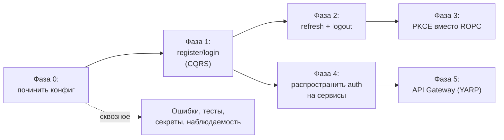
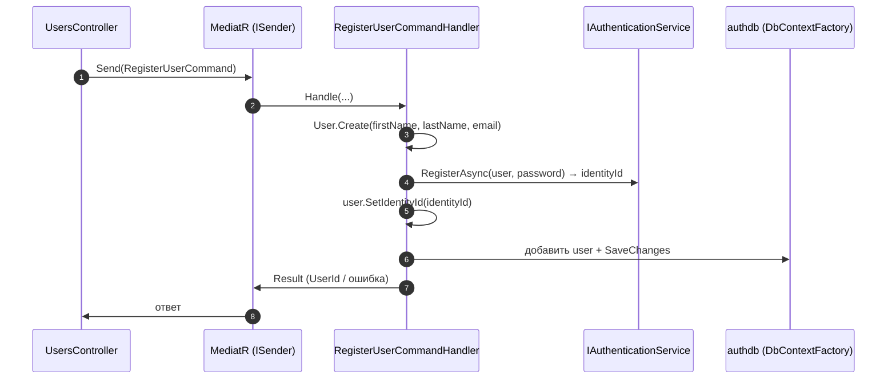
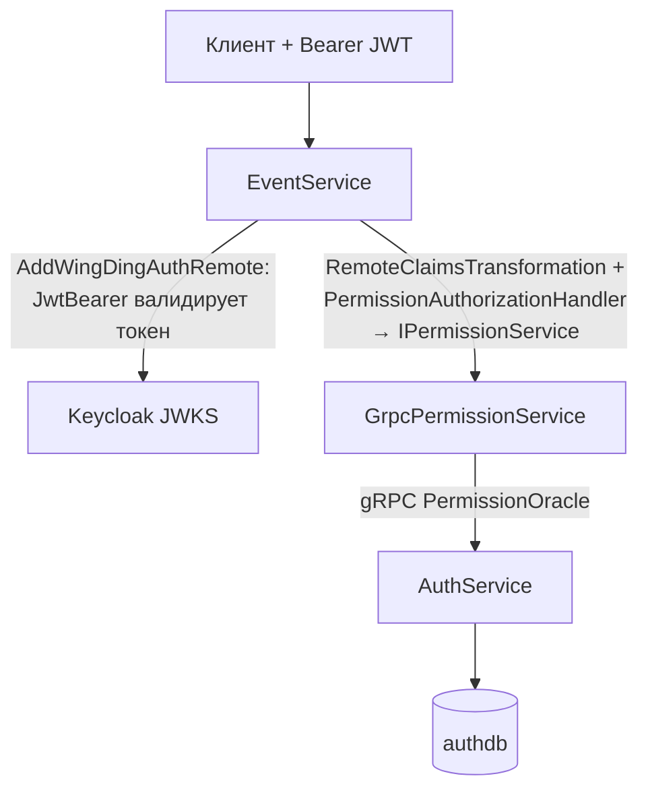
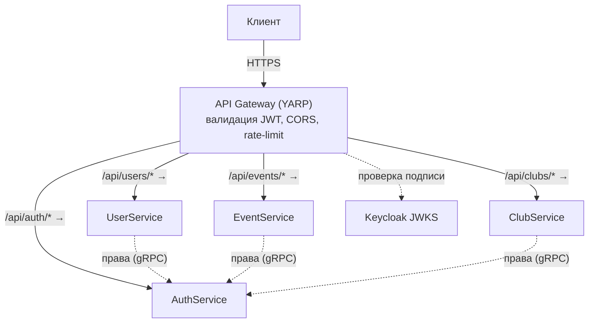

# 04 — Дорожная карта: доработка, Gateway, распространение auth

> Куда двигаться дальше. Документ построен **от фактического состояния кода** (что я прочитал
> в [01](01-authservice-flows.md)/[02](02-class-reference.md)) и общих практик — **не** от
> файлов `Plan-*.md` (они неточны и источником истины не считаются).
>
> Формат каждого пункта: **зачем → что сделать → какие классы трогать → шаги → на что
> смотреть**. Цель — чтобы ты реализовал это сам и разобрался на практике. Код за тебя я здесь
> не пишу — даю карту и ориентиры.

## Где мы сейчас (честный срез)

Что **уже есть и работает** (фундамент крепкий):
- ✅ Keycloak как IdP, realm + два клиента импортируются.
- ✅ Валидация JWT (`JwtBearerOptionsSetup`) и обвязка `[HasPermission]` (SharedKernel).
- ✅ Обогащение claims из БД (`RemoteClaimsTransformation`), кэш Redis + in-memory.
- ✅ Источник прав в `authdb`, сидинг ролей/разрешений.
- ✅ Межсервисный канal прав по gRPC (`PermissionOracle`), две реализации `IPermissionService`.
- ✅ Регистрация в Keycloak на уровне инфраструктуры (`AuthenticationService` + delegating handler).

Что **не доделано** (точки роста):
- 🚧 `register`/`login` в `UsersController` — заглушки, CQRS-команд нет.
- 🚧 Логин = ROPC (dev-only), нет refresh/logout.
- 🚧 6 конфиг-несостыковок (документ 03, раздел 4), включая незарегистрированный `RedisOptions`.
- 🚧 Нет обработки ошибок (`GlobalExceptionHandler` закомментирован, кастомных ошибок нет).
- 🚧 Нет тестов.
- 🚧 Нет API Gateway.
- 🚧 Остальные сервисы ещё не подключены к auth (`AddWingDingAuthRemote` не вызван).

## Карта фаз

Фазы 0→1→2→3 — это «довести AuthService до ума». Фазы 4→5 — «распространить на систему».
Фаза 4 может идти параллельно с 2/3, как только готова фаза 1.

---

## Фаза 0 — Починить конфигурацию (разблокировать запуск)

**Зачем.** Без этого сервис не стартует/не ходит в Keycloak и Redis (документ 03, раздел 4).
Это самый дешёвый и самый полезный первый шаг — заодно прочувствуешь, как биндятся опции.

**Что сделать (по пунктам из документа 03):**
1. `Api/DependencyInjection.cs` (`BindConfigurations`, `:49-60`) — добавить
   `services.Configure<RedisOptions>(configuration.Bind);` (несостыковка №6).
2. `docker-compose.yml` (auth-service env) — внутренние URL Keycloak на порт **8080**, не
   18080 (№1).
3. `appsettings.Development.json` — привести хосты к реальным именам сети или добавить
   сетевые `aliases` в compose; добавить пароль/хост Redis (№2, №3). Учитывай, что эти ключи
   фактически перекрываются env/секретами (документ 03, раздел 4).
4. realm-экспорт `.files/wingding-realm-export.json` — выдать service-account
   `wingding-admin-client` роль `realm-management: manage-users` (№5), чтобы регистрация через
   Admin API работала.

**На что смотреть.** После фазы 0 должны пройти разделы 5–11 документа 03 целиком (включая
запись в Redis ключей `auth:*`).

---

## Фаза 1 — Дописать register/login (CQRS через MediatR)

**Зачем.** Это «лицо» сервиса. Инфраструктура под капотом готова — нужно связать HTTP-эндпоинт
→ команду → существующие сервисы.

**Что трогать.** `Application` (новые команды/хендлеры), `Api/UsersController`, `Contracts`
(request/response DTO), маппинги Mapster.

**Архитектура — как это должно лечь на текущий код:**

**Шаги (Register):**
1. В `Contracts` — `RegisterUserRequest` (firstName, lastName, email, password) и `…Response`.
2. В `Application` — `RegisterUserCommand : IRequest<…>` и `RegisterUserCommandHandler`.
   Хендлер: `User.Create(...)` → `IAuthenticationService.RegisterAsync(...)` →
   `user.SetIdentityId(...)` → сохранить через `IDbContextFactory<AuthDbContext>` (или вводи
   репозиторий — см. ниже).
3. Зарегистрировать MediatR в `Application/DependencyInjection.cs` (сейчас пустой!) —
   `AddMediatR(...)` со сканированием сборки.
4. В `UsersController.Register` — забиндить тело, `_sender.Send(command)`, вернуть результат.
5. Подумать про идемпотентность/гонки: email уникален в БД (`UserConfiguration`), а в Keycloak
   — отдельная проверка. Что делать, если в Keycloak создан, а в БД упало? (компенсация/
   транзакционность — см. «на что смотреть»).

**Шаги (Login):**
1. `LoginRequest`/`LoginResponse` в `Contracts` (вернуть access token, а позже — и refresh).
2. `LoginCommand` + хендлер, который зовёт `IJwtService.GetAccessTokenAsync(...)`.
3. В `UsersController.Login` — `_sender.Send(...)`, обработать `null` (неверный логин → 401).

**На что смотреть.**
- **Дубликат записи при сбое.** Регистрация затрагивает две системы (Keycloak + БД). Нет
  распределённой транзакции — продумай порядок и компенсацию (например, удалить из Keycloak,
  если БД не сохранилась; или сначала БД, потом Keycloak — но тогда нужен `identityId` заранее).
- **Валидация входа.** Добавь FluentValidation или MediatR-pipeline behavior для проверки
  request'ов до хендлера.
- **Стоит ли вводить репозиторий.** Сейчас доступ к БД — через `IDbContextFactory`. Для
  команд удобнее тонкий `IUserRepository` в Application + реализация в Infrastructure (чище,
  тестируемо). Это твоё решение — но согласуй со стилем других сервисов.

---

## Фаза 2 — Refresh-токены и logout

**Зачем.** Access token короткоживущий (минуты). Без refresh пользователь будет
«разлогиниваться» постоянно. Logout нужен, чтобы инвалидировать сессию в Keycloak.

**Концепция** (документ 00, раздел 3): refresh token — долгоживущий, обменивается на новый
access token на token endpoint Keycloak (`grant_type=refresh_token`). Logout — вызов
end-session endpoint Keycloak с refresh-токеном.

**Что трогать.**
- `IJwtService`/`JwtService` — сейчас `GetAccessTokenAsync` читает только `access_token`
  (`JwtService.cs:43-44`). Расширить:
  - возвращать полный набор (`access_token`, `refresh_token`, `expires_in`) — заведи DTO,
    дополни `AuthorizationToken` (`Common/Dto/AuthenticationToken.cs`) полями;
  - метод `RefreshAsync(refreshToken)` (`grant_type=refresh_token`);
  - метод `LogoutAsync(refreshToken)` (POST на `…/protocol/openid-connect/logout`).
- `Application` — команды `RefreshTokenCommand`, `LogoutCommand`.
- `UsersController` — эндпоинты `POST /refresh`, `POST /logout`.

**На что смотреть.**
- **Где хранит токены клиент.** Refresh token — чувствителен. Для веба — `HttpOnly`/`Secure`
  cookie; не в `localStorage`. Это решается на стороне клиента/Gateway (фаза 5, BFF).
- **Ротация refresh-токенов** (Keycloak умеет) — повышает безопасность.

---

## Фаза 3 — Перейти с ROPC на Authorization Code + PKCE

**Зачем.** ROPC устарел и небезопасен (пароль проходит через наш сервис; документ 00,
раздел 2/4; комментарий в `JwtService.cs:20-23`). Прод-стандарт — redirect-поток с PKCE.
`wingding-public-client` уже сконфигурирован под это (`standardFlowEnabled`, PKCE `S256`,
redirectUris — см. realm-экспорт).

**Концепция** — документ 00, раздел 4 (полная диаграмма там).

**Что трогать.** Это в основном **смещение ответственности на клиент/Gateway**:
- Клиент (SPA/мобильный) ведёт сам redirect-поток с Keycloak (генерит `code_verifier`,
  редиректит на `/authorize`, меняет `code` на токены).
- AuthService как «логин-прокси» в этом сценарии **уже не нужен** для выдачи токена —
  токен клиент получает напрямую от Keycloak. `JwtService`/ROPC можно пометить deprecated и
  оставить только для интеграционных тестов.
- Если хочешь паттерн **BFF** (Backend-for-Frontend), redirect-поток инкапсулирует Gateway
  (фаза 5) — он же хранит токены в cookie. Тогда фронту вообще не нужно видеть токены.

**На что смотреть.** Это архитектурная развилка: «публичный клиент сам ведёт PKCE» vs «BFF на
Gateway». Реши до фазы 5 — от этого зависит роль Gateway.

---

## Фаза 4 — Распространить auth на остальные сервисы

**Зачем.** EventService/ClubService/UserService должны проверять токены и права. Вся машинерия
для этого **уже написана** в SharedKernel — нужно лишь подключить.

**Что трогать (в каждом downstream-сервисе).**
1. В `Infrastructure/DependencyInjection` вызвать
   **`AddWingDingAuthRemote(configuration, authServiceGrpcUrl)`** (SharedKernel,
   `DependencyInjection.cs:37-64`). Он поднимет: JwtBearer (та же валидация), gRPC-клиент
   `PermissionOracle`, `GrpcPermissionService` как `IPermissionService`, memory cache.
2. В `Program.cs` — `UseAuthentication()` + `UseAuthorization()` (порядок как в AuthService).
3. На эндпоинтах — `[HasPermission(Permissions.EventsCreate)]` и т.п. Строки прав — из
   `Contracts/Constants/Permissions.cs` (или раздели общий пакет констант).
4. Добавить секцию `Authentication` в конфиг сервиса (Issuer/Audience/MetadataUrl) и адрес
   gRPC AuthService.

**На что смотреть.**
- **Один общий пакет констант прав.** Сейчас `Permissions` лежит в `AuthService.Contracts`.
  Чтобы другие сервисы не зависели от контрактов AuthService, вынеси константы в SharedKernel
  (или отдельный shared-пакет). Иначе расползётся дубликация.
- **gRPC-адрес и сеть.** `AddWingDingAuthRemote` по умолчанию `http://auth-service:5200` —
  имя из docker-сети. Проверь, что совпадает с `container_name`/service name и портом.
- **gRPC reflection/TLS.** Внутри сети — plaintext HTTP/2 ок; для прода — mTLS между сервисами.
- **Версионирование `.proto`.** `authorization.proto` — общий контракт. Изменения должны быть
  обратносовместимыми (не переиспользуй номера полей).

---

## Фаза 5 — API Gateway (YARP)

> Я не опираюсь на `Plan-Gateway-YARP.md`. Ниже — самостоятельный, обоснованный дизайн под
> текущую архитектуру.

**Зачем нужен Gateway.** Сейчас у каждого сервиса свой публичный порт, каждый сам валидирует
токен, CORS/rate-limit/TLS — размазаны. Gateway даёт:
- **единую точку входа** (один хост наружу, маршрутизация на сервисы);
- **централизованную аутентификацию** (валидировать токен один раз на входе);
- **сквозные политики**: CORS, rate limiting, заголовки, TLS-termination;
- опционально — **BFF**: хранить токены в `HttpOnly`-cookie, фронт не видит JWT.

**Почему YARP.** Это reverse-proxy от Microsoft как библиотека внутри ASP.NET Core — не
отдельный продукт. Конфигурируется маршрутами (`routes`) и кластерами (`clusters`), легко
встраивает middleware аутентификации (тот же JwtBearer).

**Целевая архитектура:**

**Шаги.**
1. Новый проект `Gateway` (ASP.NET Core), пакет `Yarp.ReverseProxy`.
2. Конфиг маршрутов/кластеров (в `appsettings`): путь → кластер (адрес сервиса в docker-сети).
3. Подключить JwtBearer на Gateway (можно переиспользовать `AddWingDingAuthRemote` без gRPC, или
   только JWT-часть) — валидировать токен **на входе**.
4. Добавить в `docker-compose` сервис gateway, открыть **только его** порт наружу; порты
   сервисов оставить внутри сети.
5. CORS/rate limiting/корреляционные заголовки — на Gateway.

**Важное разграничение (типичная ошибка):**
- Gateway проверяет **аутентификацию** (токен валиден) и маршрутизирует. Он **не должен**
  брать на себя проверку **прав** (`permission`) — это остаётся в сервисах через
  `[HasPermission]`, потому что права контекстны (зависят от ресурса). Gateway = «впустить в
  здание», сервис = «впустить в комнату».
- Сервисы **всё равно валидируют токен сами** (defense in depth) — Gateway не делает их
  «доверчивыми». Либо явный mTLS + внутренняя сеть, чтобы сервис принимал только трафик от
  Gateway.

**Развилка BFF (связано с фазой 3).** Если выберешь BFF — redirect-поток PKCE и хранение
токенов в cookie живут на Gateway, фронт работает по cookie-сессии. Если нет — Gateway просто
проксирует Bearer-токены, выданные клиенту напрямую Keycloak.

---

## Сквозные задачи (делать параллельно)

### Обработка ошибок
Сейчас везде `throw new ApplicationException(...)` и закомментированный `GlobalExceptionHandler`
(`Api/DependencyInjection.cs:65`). Что сделать:
- Ввести доменные/прикладные исключения (есть пометки `// todo custom errors + handler` в
  `UserContext.cs`, `ClaimsPrincipalExtensions.cs`).
- Реализовать `IExceptionHandler` (`GlobalExceptionHandler`), маппить исключения в
  `ProblemDetails` (уже подключён, `:66`).
- Договориться о кодах: нет токена → 401, нет права → 403, не найдено → 404 и т.д.

### Тесты
Тестов нет — это критично для сервиса безопасности. Минимум:
- **Unit** на Domain (`User.Create` выдаёт `Registered`; equality `Entity`/`ValueObject`;
  `Enumeration.GetFromName`).
- **Unit** на `RemoteClaimsTransformation` и `PermissionAuthorizationHandler` (мок
  `IPermissionService`) — проверить логику «есть право → Succeed».
- **Integration** через `WebApplicationFactory` + Testcontainers (Postgres, Redis) +
  тестовый Keycloak (или замоканный JWKS) — сквозной `/me` 200/401/403.

### Секреты
`AdminClientSecret = CHANGE_ME_IN_PRODUCTION` лежит в `appsettings`/realm-экспорте. Вынести в
секрет-менеджер (User Secrets локально, env/vault в проде). Пометки `// TODO: move to .env or
secret manager` уже стоят (`Infrastructure/DependencyInjection.cs:51`).

### Наблюдаемость
- Корреляционные id между Gateway → сервисы → gRPC (для трассировки запроса).
- Метрики кэша (hit/miss Redis и memory) — понять эффективность двухслойного кэша.
- Аудит auth-событий (вход, отказ в доступе) — отдельный лог/топик Kafka (Kafka уже в стеке).

### Контракт прав — единый источник
Сейчас разрешения определены **трижды**: `Permission` (Domain), `Permissions` (Contracts),
сидинг в `RoleConfiguration`. Подумай про генерацию `Permissions`-констант из `Permission`
(или общий source-of-truth), чтобы не рассинхронить (документ 02, риск в Contracts).

---

## Сводная таблица «что → где → зачем»

| Задача | Где основные изменения | Разблокирует |
|---|---|---|
| Фаза 0: конфиг | `*/DependencyInjection.cs`, `docker-compose*`, realm-экспорт | запуск и тесты |
| Фаза 1: register/login | `Application` (CQRS), `UsersController`, `Contracts` | реальный сквозной поток |
| Фаза 2: refresh/logout | `JwtService`, `Application`, `UsersController` | удобные сессии |
| Фаза 3: PKCE | клиент/Gateway, deprecate `JwtService` ROPC | прод-безопасность |
| Фаза 4: auth в сервисах | `AddWingDingAuthRemote` в каждом сервисе | защита всего API |
| Фаза 5: Gateway (YARP) | новый проект `Gateway`, `docker-compose` | единый вход, политики |
| Ошибки | `GlobalExceptionHandler`, доменные исключения | предсказуемые ответы |
| Тесты | новый тест-проект | надёжность |
| Секреты | секрет-менеджер | безопасность |

---

## Рекомендуемый порядок «с чего начать прямо сейчас»

1. **Фаза 0** целиком — поднять и проверить сервис по документу 03 (час-два, максимум пользы).
2. **Фаза 1, Register** — самая показательная: соберёшь CQRS поверх готовой инфраструктуры и
   увидишь весь поток регистрации вживую.
3. **Фаза 1, Login** + **Фаза 4 на одном сервисе** (например, EventService) — получишь первый
   полный сквозной сценарий «логин → запрос в другой сервис → проверка прав через gRPC».
4. Дальше — refresh/PKCE/Gateway по мере необходимости.

После каждого шага возвращайся к документам 01/02 — они описывают, как кусочек встраивается в
общую картину.

---

⬅️ Назад к началу: [README](README.md) · [00 Концепции](00-auth-concepts.md) ·
[01 Сценарии](01-authservice-flows.md) · [02 Классы](02-class-reference.md) ·
[03 Тестирование](03-testing-and-operations.md)
