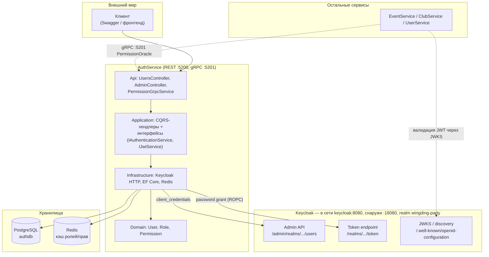
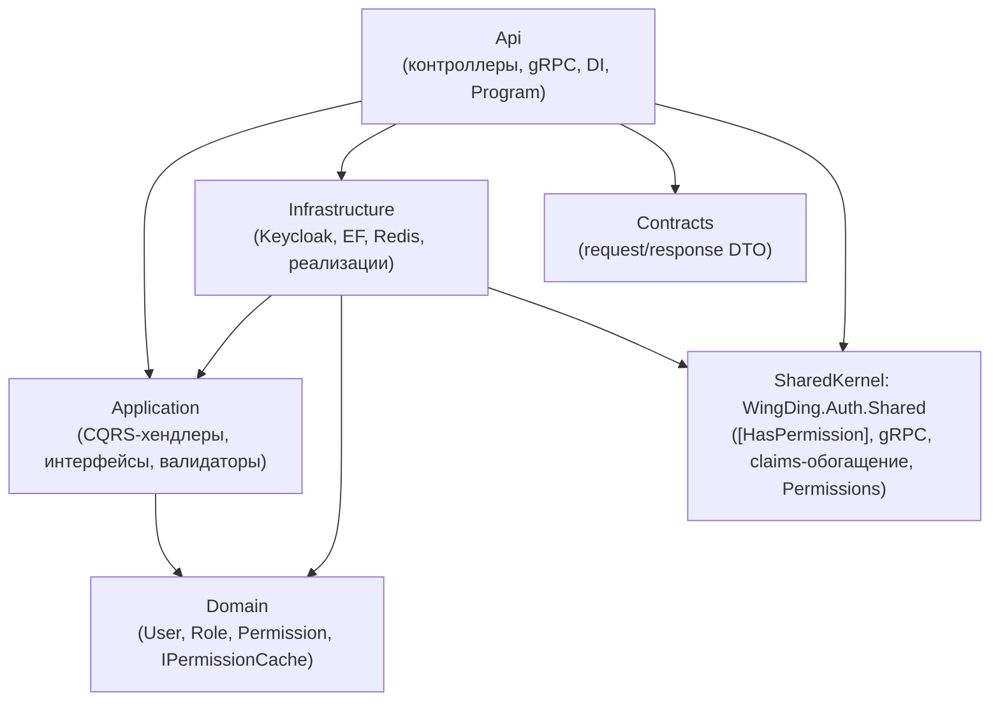
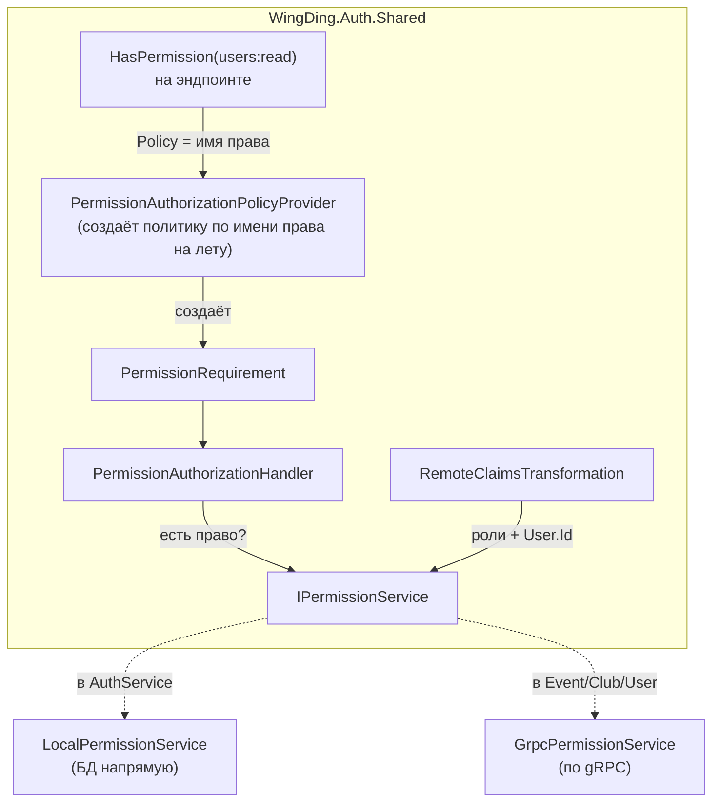
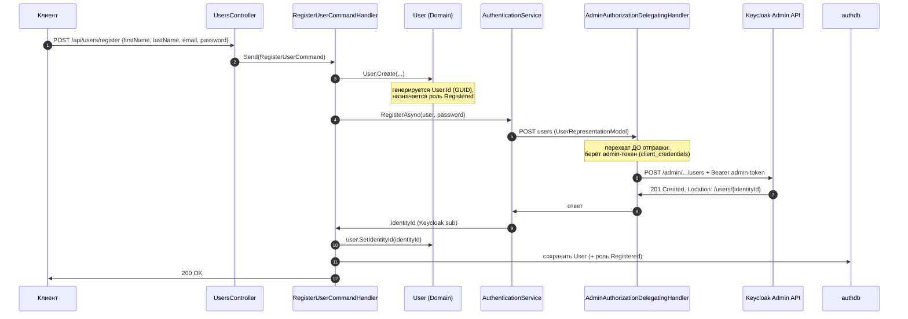
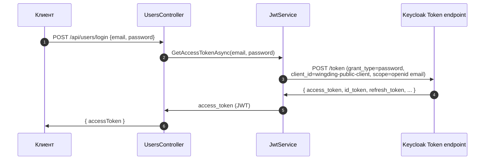
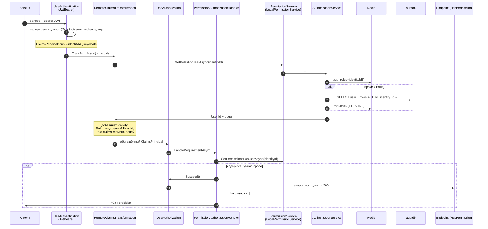
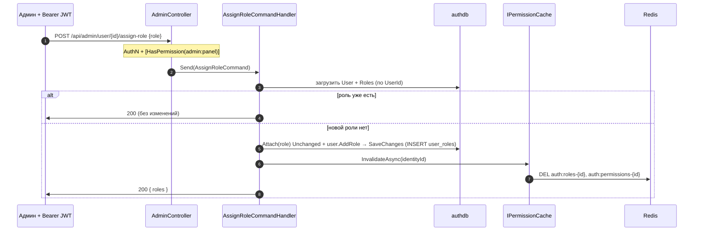
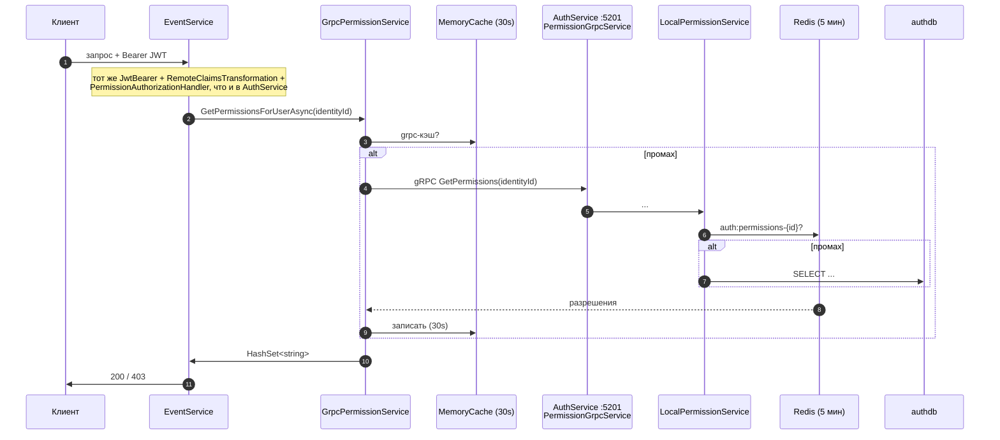
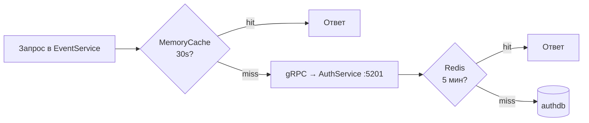
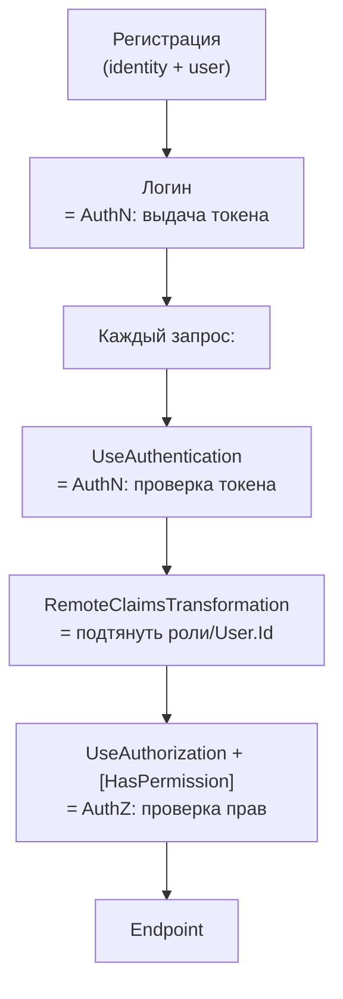

# AuthService — документация

Краткая, но полная документация по сервису аутентификации и авторизации WingDing Party.
Стек: **.NET 10**, **Keycloak** (OIDC IdP), **PostgreSQL** (`authdb`), **Redis** (кэш прав),
**gRPC** (межсервисный канал прав). Архитектура — Clean Architecture + DDD.

## Оглавление
1. [Что делает AuthService](#1-что-делает-authservice)
2. [Архитектура](#2-архитектура)
3. [Роль Keycloak](#3-роль-keycloak)
4. [authdb — источник прав](#4-authdb--источник-прав)
5. [RBAC / PBAC — модель прав](#5-rbac--pbac--модель-прав)
6. [Сквозные сценарии (flows)](#6-сквозные-сценарии-flows)
7. [FAQ](#7-faq)
8. [Что дальше](#8-что-дальше)

---

## 1. Что делает AuthService

У сервиса **две роли**:

1. **Фасад к Keycloak** — прячет Admin API и token endpoint за чистыми интерфейсами
   (`IAuthenticationService`, `IJwtService`). Регистрация и логин идут через него.
2. **Источник истины о правах** — роли и разрешения лежат в `authdb`, и AuthService отдаёт их
   остальным сервисам по gRPC (`PermissionOracle`).



Два идентификатора, которые легко перепутать:

| Идентификатор | Что это | Где появляется |
|---|---|---|
| **identityId** | id пользователя **в Keycloak** (claim `sub` в JWT) | возвращается при регистрации, сидит в каждом токене |
| **User.Id** | id пользователя **в нашей БД** (`authdb`), GUID | генерируется при `User.Create()` |

Связь между ними — поле `users.identity_id` (уникальный индекс).

---

## 2. Архитектура

Каждый слой Clean Architecture зависит только «внутрь», к Domain. Domain не зависит ни от чего.



**Слои кратко:**

| Слой | Ответственность |
|---|---|
| **Domain** | сущности `User`/`Role`, перечни `Permission`/`RoleType`, строго типизированные id (`UserId`/`RoleId`), DDD-абстракции (`Entity<TId>`, `ValueObject`, `Enumeration`), абстракция `IPermissionCache`. Бизнес-правила (напр. «новый `User` сразу получает роль `Registered`»). |
| **Application** | CQRS через MediatR: команды/запросы + хендлеры (`RegisterUser`, `LoginUser`, `AssignRole`), интерфейсы (`IAuthenticationService`, `IJwtService`, `IAuthDbContext`), FluentValidation-валидаторы + `ValidationBehavior`, каталог ошибок `ServiceErrors`. |
| **Infrastructure** | реализации: фасады к Keycloak (`AuthenticationService`, `JwtService`, `AdminAuthorizationDelegatingHandler`), EF Core (`AuthDbContext` + конфигурации/сидинг), права из БД (`AuthorizationService`, `LocalPermissionService`), сброс кэша (`PermissionCache`), `JwtBearerOptionsSetup`. |
| **Api** | `Program.cs` (конвейер middleware), `UsersController` (register/login), `AdminController` (assign-role), `PermissionGrpcService` (gRPC-сервер прав), Swagger с Bearer-кнопкой, exception handlers. |
| **Contracts** | request/response DTO для эндпоинтов. |
| **SharedKernel (`WingDing.Auth.Shared`)** | **общий слой авторизации для всех сервисов**: `[HasPermission]`, policy provider, `PermissionAuthorizationHandler`, `RemoteClaimsTransformation`, контракт `IPermissionService` + `GrpcPermissionService`, gRPC-контракт `PermissionOracle`, строковые константы `Permissions`. |

> 🔑 Благодаря SharedKernel `[HasPermission]` работает **одинаково** во всех сервисах — меняется
> только то, *откуда берутся права* (`IPermissionService`): в AuthService это `LocalPermissionService`
> (БД напрямую), в остальных — `GrpcPermissionService` (по gRPC в AuthService).

---

## 3. Роль Keycloak

Keycloak — внешний **источник идентичности** (IdP). Он отвечает только на вопрос «кто ты»
(аутентификация): хранит пользователей, проверяет пароли, выпускает и подписывает JWT.
На вопрос «что тебе можно» (авторизация) Keycloak **не отвечает** — это делает `authdb`.

AuthService использует **два разных клиента** Keycloak:

| Клиент | Тип | Grant | Зачем |
|---|---|---|---|
| `wingding-admin-client` | confidential (с секретом) | `client_credentials` | AuthService от своего имени создаёт пользователей в Keycloak (Admin API) |
| `wingding-public-client` | public | `password` (ROPC, dev) | получить токен пользователя по логину/паролю. Уже сконфигурирован и под `standardFlow` + PKCE S256 — для будущего перехода (раздел 8) |

Конфигурация (значения для запуска в docker-сети):

```jsonc
"Authentication": {
  "Audience":    "account",
  "Issuer":      "http://localhost:18080/realms/wingding-party",   // как в claim iss токена (внешний хост)
  "MetadataUrl": "http://keycloak:8080/realms/wingding-party/.well-known/openid-configuration", // JWKS из сети (порт 8080!)
  "RequireHttpsMetadata": false
},
"Keycloak": {
  "AdminUrl": "http://keycloak:8080/admin/realms/wingding-party/",
  "TokenUrl": "http://keycloak:8080/realms/wingding-party/protocol/openid-connect/token",
  "AdminClientId": "wingding-admin-client",
  "AuthClientId":  "wingding-public-client"
}
```

> ⚠️ **Issuer vs JWKS.** Токен выпущен через внешний хост → `iss = localhost:18080`. А ключи для
> проверки подписи сервис тянет **из сети** по `keycloak:8080` (внутренний порт **8080**, не 18080).
> Поэтому `Issuer` = внешний адрес, а `MetadataUrl` = внутренний. Несоответствие здесь — частая
> причина `401`.

Валидацию входящих токенов настраивает `JwtBearerOptionsSetup` (`Audience`, `ValidIssuer`,
`MetadataAddress` для JWKS). Публичные ключи кэшируются, так что на каждый запрос в Keycloak
ходить не нужно.

---

## 4. authdb — источник прав

Схема (snake_case, `UseSnakeCaseNamingConvention`):

| Таблица | Что хранит |
|---|---|
| `users` | `id` (GUID), профиль, **`identity_id`** (= Keycloak `sub`, уникальный индекс) |
| `roles` | 4 роли (`id` 1–4, `role_type`) |
| `permissions` | 11 разрешений (`id`, `name` вида `events:create`) |
| `role_permissions` | связка роль↔разрешение (матрица прав) |
| `user_roles` | связка пользователь↔роль (`roles_id`, `users_id`) |

Роли, разрешения и их связки **сидятся миграцией** (`RoleConfiguration` / `PermissionConfiguration`)
и применяются автоматически при старте (`ApplyMigrations()`). В рантайме создаются только записи
`users` и `user_roles`.

**Кэш прав (Redis).** `AuthorizationService` читает роли/права из БД и кэширует в Redis:
ключи `auth:roles-{identityId}` и `auth:permissions-{identityId}`, TTL **5 минут**. Используется
`IDbContextFactory<AuthDbContext>` (а не scoped `DbContext`), потому что чтение прав вызывается из
`IClaimsTransformation`/authorization-хендлеров, которые могут работать вне scope запроса.

**Инвалидация кэша.** При изменении ролей через API (`assign-role`) хендлер вызывает
`IPermissionCache.InvalidateAsync(identityId)` (реализация `PermissionCache` — `DEL` обоих ключей
в Redis), чтобы новые права применились немедленно, а не через TTL.

---

## 5. RBAC / PBAC — модель прав

Система двухуровневая: **RBAC** (пользователю назначаются роли) поверх **PBAC** (эндпоинты
проверяют конкретные разрешения).

**Матрица ролей → разрешений** (сидинг `RoleConfiguration`):

| Роль (`id`) | Разрешения |
|---|---|
| **Guest** (1) | `events:read`, `clubs:read` |
| **Registered** (2) | `events:read`, `clubs:read`, `users:read` |
| **Moderator** (3) | + `events:create/update`, `clubs:create/update`, `users:update` |
| **Admin** (4) | все, включая `events:delete`, `clubs:delete`, **`admin:panel`** |

Новый пользователь автоматически получает роль **`Registered`** (`User.Create`), поэтому сразу
имеет `*:read`. Разрешения определены типобезопасно как `Permission : Enumeration` (Domain), а их
строковые константы для атрибутов — в `WingDing.Auth.Shared/Permissions.cs` (SharedKernel, чтобы
любой сервис ставил атрибуты, не завязываясь на Domain AuthService).

**PBAC-механика** (общий код в SharedKernel, работает во всех сервисах):



- `[HasPermission("...")]` (наследник `AuthorizeAttribute`) кладёт имя права в `Policy`.
- `PermissionAuthorizationPolicyProvider` создаёт политику по этому имени **на лету** и кэширует.
- `PermissionAuthorizationHandler` берёт `identityId`, через `IPermissionService` получает множество
  прав и делает `Succeed`, если нужное право есть — иначе `403`.

---

## 6. Сквозные сценарии (flows)

### 6.1. Регистрация

Пользователь создаётся **в двух местах**: в Keycloak (чтобы уметь логиниться) и в `authdb`
(чтобы хранить роли/права). `RegisterUserCommandHandler` оркеструет процесс.



Ключевое: исходящий запрос к Admin API авторизует `AdminAuthorizationDelegatingHandler`
(Client Credentials Flow), а `AuthenticationService` об этом не знает. `identityId` парсится из
заголовка `Location` ответа `201`.

### 6.2. Логин

Пользователь меняет логин/пароль на access token. Сейчас это **ROPC** (пароль проходит через наш
сервис) — допустимо для dev; прод-вариант — PKCE (раздел 8).



### 6.3. Запрос к защищённому эндпоинту (сердце системы)

Связывает **аутентификацию** (проверка токена) и **авторизацию** (проверка права). Порядок задаёт
`Program.cs`: `UseAuthentication()` → `UseAuthorization()`.



> 🔑 Токен Keycloak отвечает только «кто ты». На «что тебе можно» отвечает **наша БД**, а её данные
> «вклеиваются» в запрос механизмом `IClaimsTransformation`. Поэтому смена прав применяется почти
> мгновенно (максимум — TTL кэша или сразу при явной инвалидации), не дожидаясь истечения токена.

### 6.4. Назначение роли (RBAC-управление)

Админский эндпоинт `POST /api/admin/user/{id}/assign-role`, закрытый `[HasPermission(admin:panel)]`.
Аддитивно выдаёт пользователю роль и сразу сбрасывает его кэш прав.



### 6.5. Межсервисная авторизация (gRPC)

EventService/ClubService/UserService не имеют доступа к `authdb`. Чтобы узнать права пользователя,
они спрашивают AuthService по gRPC (`PermissionOracle`, порт **5201**). Код проверки прав — тот же
общий из SharedKernel; отличается только реализация `IPermissionService` (`GrpcPermissionService`).



Получается **два слоя кэша**: 30 сек in-memory в вызывающем сервисе + 5 мин Redis в AuthService.



> ⚙️ AuthService слушает **два порта**: `5200` (REST, HTTP/1) и `5201` (gRPC, HTTP/2 h2c).
> Downstream-сервисы подключаются через `AddWingDingAuthRemote(...)` с
> `AuthServiceGrpcUrl = http://auth-service:5201`.

### Когда AuthN, когда AuthZ



---

## 7. FAQ

### Как завести нового пользователя?

`POST /api/users/register` — создаёт пользователя и в Keycloak, и в `authdb`, выдаёт роль `Registered`:

```http
POST http://localhost:5200/api/users/register
Content-Type: application/json

{ "firstName": "Lupa", "lastName": "Pupa", "email": "lupa@example.com", "password": "Passw0rd123" }
```

Затем `POST /api/users/login` с теми же email/password вернёт `accessToken`. Свежий пользователь
сразу имеет `*:read` (роль `Registered`).

### Как сделать первого админа? (bootstrap)

`admin:panel` есть только у роли `Admin`, а назначать роли через API может только тот, у кого уже
есть `admin:panel`. Поэтому **первого** админа заводят в обход API:

1. Зарегистрировать пользователя (см. выше) — он попадёт в `authdb` со связью `identity_id`.
2. Выдать роль `Administrator` (`id = 4`) напрямую в БД:

```sql
-- по базе authdb
INSERT INTO user_roles (roles_id, users_id)
SELECT 4, u.id FROM users u WHERE u.email = 'admin@example.com'
ON CONFLICT DO NOTHING;
```

3. Залогиниться — токен этого пользователя теперь несёт `admin:panel` (через gRPC/БД, не в самом JWT).

> Если пользователь уже ходил под старой ролью, сбрось кэш: `DEL auth:roles-{sub} auth:permissions-{sub}`
> в Redis (или в dev — `FLUSHALL`).

### Как от имени админа повысить роль другому пользователю?

Это и есть штатный путь после bootstrap — через API, **без SQL**:

```http
POST http://localhost:5200/api/admin/user/{userId}/assign-role
Authorization: Bearer <admin access token>
Content-Type: application/json

{ "id": "{userId}", "role": "Moderator" }
```

Эндпоинт закрыт `[HasPermission(admin:panel)]` → вызвать может только админ. Хендлер аддитивно
добавляет роль в `user_roles` и **сам сбрасывает кэш прав** целевого пользователя — новые права
применяются немедленно. Допустимые роли: `Guest`, `Registered`, `Moderator`, `Administrator`.

### Как авторизоваться в Swagger?

Открой `/swagger`, нажми **Authorize**, вставь **только сам JWT** (без префикса `Bearer` — схема
`bearer` допишет его сама). После этого запросы из Swagger несут заголовок `Authorization`.

### 401 или 403 — в чём разница?

- **401 Unauthorized** — токен не пришёл/невалиден/протух (ROPC-токен живёт ~5 мин). Проблема
  аутентификации.
- **403 Forbidden** — токен валиден, но у пользователя нет нужного права. Проблема авторизации.

---

## 8. Что дальше

Сделано: register/login (CQRS), распространение auth на Event/Club/User, назначение ролей
(`assign-role`) + обработка ошибок (`ServiceErrors`/`GlobalExceptionHandler`) и FluentValidation.

Осталось:

- **Refresh-токены и logout.** Сейчас выдаётся только короткоживущий access token. Нужны обмен
  refresh-токена на новый access (`grant_type=refresh_token`) и end-session (logout) в Keycloak.
- **Переход с ROPC на Authorization Code + PKCE.** ROPC небезопасен: пароль проходит через наш
  сервис. Прод-стандарт — redirect-поток, где пароль вводится **только** на странице Keycloak, а
  клиент обменивает `code` на токены с проверкой `code_verifier` (PKCE S256). `wingding-public-client`
  уже сконфигурирован под это (`standardFlow`, PKCE S256, redirectUris). AuthService как «логин-прокси»
  в этом сценарии перестаёт быть нужен для выдачи токена; `JwtService`/ROPC останется только для тестов.
- **API Gateway (YARP).** Единая точка входа: централизованная валидация JWT, CORS, rate-limiting,
  TLS. Права (`[HasPermission]`) остаются в сервисах (они контекстны). Опционально — паттерн BFF
  (хранение токенов в `HttpOnly`-cookie на Gateway).
- **Сквозное.** Тесты (unit на Domain/claims-transform/handler + integration через
  `WebApplicationFactory` + Testcontainers); вынос секретов (`AdminClientSecret`) в secret-manager;
  наблюдаемость (correlation id, метрики кэша, аудит auth-событий).
- **Единый источник констант прав.** Сейчас разрешения заданы в `Permission` (Domain), `Permissions`
  (SharedKernel) и сидинге `RoleConfiguration` — кандидат на генерацию из одного источника, чтобы не
  рассинхронить.
