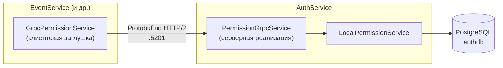
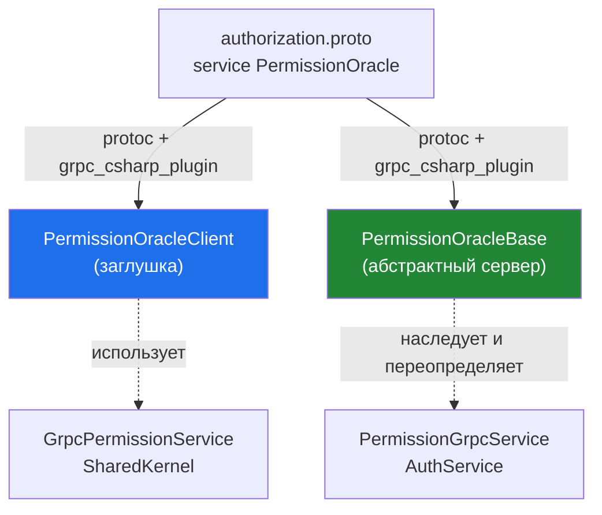
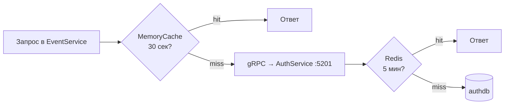

# gRPC в WingDing Party — как это работает

Документация по межсервисному каналу прав на gRPC. Объясняет **главное недопонимание**, на
которое почти все натыкаются: «почему сгенерированный из `.proto` код не ходит в БД — он же
должен отдавать права?».

Связанный документ: [`auth_doc.md`](./auth_doc.md) (раздел 6.5 — место gRPC в общей картине
авторизации). Здесь — детальный разбор именно gRPC-механики.

## Оглавление
1. [TL;DR](#1-tldr)
2. [Зачем вообще gRPC](#2-зачем-вообще-grpc)
3. [Контракт: `authorization.proto`](#3-контракт-authorizationproto)
4. [Две половины из одного `.proto`](#4-две-половины-из-одного-proto)
5. [Клиентская половина — `GrpcPermissionService`](#5-клиентская-половина--grpcpermissionservice)
6. [Серверная половина — `PermissionGrpcService`](#6-серверная-половина--permissiongrpcservice)
7. [Полная трассировка запроса](#7-полная-трассировка-запроса)
8. [Два слоя кэша](#8-два-слоя-кэша)
9. [Регистрация в DI и порты](#9-регистрация-в-di-и-порты)
10. [FAQ / частые заблуждения](#10-faq--частые-заблуждения)

---

## 1. TL;DR

- Из одного `authorization.proto` генерируются **две половины**: клиентская заглушка
  (`PermissionOracleClient`) и серверный базовый класс (`PermissionOracleBase`).
- **Клиентская** половина (`GrpcPermissionService` в SharedKernel) **не ходит в БД** — это
  нормально. Её работа: сериализовать запрос в Protobuf и отправить байты по HTTP/2 на адрес
  AuthService.
- **Серверная** половина (`PermissionGrpcService` в AuthService) принимает байты, десериализует и
  делегирует… **тому же `LocalPermissionService`**, который AuthService использует и для себя.
- На дне всё равно лежит `LocalPermissionService → AuthorizationService → PostgreSQL` (+ Redis).
- Сетевой вызов существует не ради скорости, а потому что **`authdb` принадлежит только
  AuthService** — другие сервисы не имеют к ней доступа и обязаны спрашивать у владельца.



---

## 2. Зачем вообще gRPC

Важно разделять два разных вопроса.

**Почему вообще сетевой вызов (главное).** Это не про производительность. EventService /
ClubService / UserService **физически не имеют доступа к `authdb`** — этой базой владеет только
AuthService. Это граница сервиса: «не лезь в чужую БД, спрашивай у владельца через его API». Если
бы downstream-сервис мог сам сходить в `authdb`, gRPC был бы не нужен. Причина вызова —
**владение данными и изоляция сервисов**.

**Почему именно gRPC, а не REST + JSON (это уже про эффективность).** Выигрыш не «только в
байтах»:

| Аспект | gRPC | REST + JSON |
|---|---|---|
| **Формат** | Protobuf (бинарный), ~5× компактнее | текстовый JSON |
| **Транспорт** | HTTP/2: одно постоянное соединение, мультиплексирование | обычно HTTP/1.1, переустановка соединений |
| **Контракт** | `.proto` — единый источник истины, код генерится для клиента и сервера | контракт «на словах», ошибки ловятся в рантайме |
| **CPU** | дешёвая бинарная (де)сериализация | парсинг строк JSON |
| **Типобезопасность** | поменял контракт → не компилируется | опечатка в имени поля → падение в рантайме |

> 🔑 Итог одной фразой: **сетевой вызов есть потому, что данные живут в чужом сервисе; gRPC выбран
> потому, что это самый дешёвый и типобезопасный способ сделать такой межсервисный вызов.**

---

## 3. Контракт: `authorization.proto`

Единственный источник истины — `src/SharedKernel/WingDing.Auth.Shared/Protos/authorization.proto`:

```proto
syntax = "proto3";
option csharp_namespace = "WingDing.Auth.Shared.Grpc";
package authservice;

// Service-to-service Permission Oracle.
service PermissionOracle {
    rpc GetPermissions (PermissionRequest) returns (PermissionResponse);
    rpc GetRoles        (RolesRequest)      returns (RolesResponse);
}

message PermissionRequest  { string identity_id = 1; }
message PermissionResponse { repeated string permissions = 1; }
message RolesRequest       { string identity_id = 1; }
message RolesResponse {
    string user_id = 1;            // наш внутренний User.Id (GUID как строка)
    repeated string role_names = 2;
}
```

При сборке `Grpc.Tools` запускает `protoc` + `grpc_csharp_plugin` и генерирует C#-классы в
namespace `WingDing.Auth.Shared.Grpc`. **Этот сгенерированный код не коммитится** — он создаётся в
`obj/` при каждой сборке (поэтому и в `.graphifyignore`).

---

## 4. Две половины из одного `.proto`

Главный момент. `grpc_csharp_plugin` создаёт из одного `service PermissionOracle` **два** класса:

| Сгенерированный класс | Кто это | Где используется в нашем коде |
|---|---|---|
| `PermissionOracle.PermissionOracleClient` | **клиент** (заглушка / stub) | inject-ится в `GrpcPermissionService` (SharedKernel) |
| `PermissionOracle.PermissionOracleBase` | **сервер** (абстрактный базовый) | наследуется `PermissionGrpcService` (AuthService) |



Тот сгенерированный код, который выглядит «совсем не как обращение к БД», — это **клиентская**
половина. Например:

```csharp
// сгенерированная заглушка PermissionOracleClient
public virtual AsyncUnaryCall<PermissionResponse> GetPermissionsAsync(
    PermissionRequest request, CallOptions options)
{
    return CallInvoker.AsyncUnaryCall(__Method_GetPermissions, null, options, request);
}
```

Эта строка буквально означает: «возьми `request`, сериализуй в Protobuf-байты, открой HTTP/2-поток
на настроенный адрес, отправь байты, дождись ответа, десериализуй в `PermissionResponse`».
**БД тут взяться неоткуда — и это правильно.** `__Method_GetPermissions` — просто дескриптор (имя
RPC + как (де)сериализовать), `CallInvoker` — транспорт.

---

## 5. Клиентская половина — `GrpcPermissionService`

`src/SharedKernel/WingDing.Auth.Shared/Services/GrpcPermissionService.cs` — реализация
`IPermissionService`, которую используют **все сервисы, кроме AuthService**.

```csharp
public async Task<HashSet<string>> GetPermissionsForUserAsync(string identityId)
{
    // ... сначала проверка локального MemoryCache (30s) ...

    // gRPC-вызов: только сериализация + отправка байт по сети
    var response = await _client.GetPermissionsAsync(
        new PermissionRequest { IdentityId = identityId });

    HashSet<string> permissions = [.. response.Permissions];
    // ... запись в MemoryCache ...
    return permissions;
}
```

Что делает этот класс:
- оборачивает сгенерированную заглушку `_client` (`PermissionOracleClient`);
- добавляет **локальный кэш** `IMemoryCache` с TTL **30 секунд** (чтобы не дёргать сеть на каждый
  запрос);
- транслирует gRPC-ошибки в доменное поведение:
  - `StatusCode.Unavailable` → лог + проброс (AuthService недоступен);
  - `StatusCode.NotFound` → вернуть пустой набор (identity не найден);
  - прочее → лог + проброс.

Класс знает **только** «как позвать», но не «куда» — адрес задаётся при регистрации DI (см.
[раздел 9](#9-регистрация-в-di-и-порты)).

---

## 6. Серверная половина — `PermissionGrpcService`

`src/AuthService/AuthService.Api/gRPC/Services/PermissionGrpcService.cs` — наследник
сгенерированного `PermissionOracleBase`. Живёт **только в AuthService**, наружу (во фронтенд) не
выставлен — доступен лишь внутри docker-сети.

```csharp
public sealed class PermissionGrpcService : PermissionOracle.PermissionOracleBase
{
    private readonly IPermissionService _permissionService;

    public PermissionGrpcService(IPermissionService permissionService)
        => _permissionService = permissionService;

    public override async Task<PermissionResponse> GetPermissions(
        PermissionRequest request, ServerCallContext context)
    {
        HashSet<string> permissions = await _permissionService   // ← вот он, поход в БД
            .GetPermissionsForUserAsync(request.IdentityId);

        var response = new PermissionResponse();
        response.Permissions.AddRange(permissions);
        return response;
    }
    // GetRoles — аналогично
}
```

Ключевой момент: какой `IPermissionService` сюда inject-ится? В DI AuthService
(`AuthService.Infrastructure/DependencyInjection.cs:43`):

```csharp
services.AddScoped<IPermissionService, LocalPermissionService>();
```

**Тот самый `LocalPermissionService`**, который ходит в БД напрямую. То есть gRPC-вызов из
EventService в конечном счёте исполняет ровно ту же логику, что AuthService гоняет и для себя.
gRPC-слой — это просто «сетевая обёртка» поверх `LocalPermissionService`.

> 🔑 У `LocalPermissionService` фактически **два входа**:
> - **изнутри AuthService** — напрямую (его claims-transformation / authorization-handler дёргают `IPermissionService`);
> - **снаружи** — через `PermissionGrpcService`, который принимает сетевой вызов и делегирует туда же.

---

## 7. Полная трассировка запроса

Сценарий: EventService проверяет права пользователя на защищённом эндпоинте.

```mermaid
sequenceDiagram
    autonumber
    participant EV as EventService<br/>GrpcPermissionService
    participant MEM as MemoryCache (30s)
    participant NET as HTTP/2 (Protobuf)
    participant PGS as AuthService :5201<br/>PermissionGrpcService
    participant LPS as LocalPermissionService
    participant AZ as AuthorizationService
    participant REDIS as Redis (5 мин)
    participant DB as authdb

    EV->>MEM: grpc:perms:{identityId}?
    alt попадание в кэш
        MEM-->>EV: HashSet&lt;string&gt; (готово)
    else промах
        Note over EV: _client.GetPermissionsAsync(req)<br/>= сериализация в байты
        EV->>NET: PermissionRequest (Protobuf)
        NET->>PGS: байты прилетели
        Note over PGS: десериализация → request.IdentityId
        PGS->>LPS: GetPermissionsForUserAsync(id)
        LPS->>AZ: ...
        AZ->>REDIS: auth:permissions-{id}?
        alt промах Redis
            AZ->>DB: SELECT user + roles + permissions
            AZ->>REDIS: записать (TTL 5 мин)
        end
        AZ-->>PGS: HashSet&lt;string&gt;
        PGS->>NET: PermissionResponse (Protobuf)
        NET->>EV: байты обратно → десериализация
        EV->>MEM: записать (TTL 30s)
    end
```

Левая часть (`EventService`) — клиентская половина: кэш + сериализация + сеть. Правая часть
(начиная с `PermissionGrpcService`) — серверная половина: десериализация + `LocalPermissionService`
+ БД/Redis. Downstream-сервис даже не знает, что под капотом сетевой вызов, — он просто зовёт
`IPermissionService`.

---

## 8. Два слоя кэша

Чтобы пореже доходить до сетевой цепочки и до БД, кэш стоит **на обеих сторонах**:



| Слой | Где | TTL | Ключ |
|---|---|---|---|
| `IMemoryCache` | в вызывающем сервисе (`GrpcPermissionService`) | 30 сек | `grpc:perms:{id}`, `grpc:roles:{id}` |
| Redis | в AuthService (`AuthorizationService`) | 5 мин | `auth:permissions-{id}`, `auth:roles-{id}` |

> ⚠️ Следствие: после смены роли через `assign-role` AuthService сбрасывает **только Redis-слой**.
> Локальный 30-секундный `MemoryCache` в downstream-сервисе живёт своим TTL — поэтому новые права
> там могут примениться с задержкой до 30 секунд. Для прав это приемлемый компромисс.

---

## 9. Регистрация в DI и порты

**Downstream-сервисы** (Event / Club / User) подключают gRPC через `AddWingDingAuthRemote`
(`SharedKernel/WingDing.Auth.Shared/DependencyInjection.cs`):

```csharp
services.AddGrpcClient<PermissionOracle.PermissionOracleClient>(options =>
{
    options.Address = new Uri(authSection["AuthServiceGrpcUrl"] ?? "http://auth-service:5200");
});
services.AddScoped<IPermissionService, GrpcPermissionService>();
```

**AuthService** регистрирует gRPC-**сервер**: `AddGrpc()` (`AuthService.Api/DependencyInjection.cs:24`)
+ `app.MapGrpcService<PermissionGrpcService>()` (`Program.cs:38`), а `IPermissionService` биндит на
`LocalPermissionService` (никакого gRPC-клиента у самого AuthService нет).

**Порты.** AuthService слушает **два** порта (`AuthService.Api/Program.cs:17-18`):

```csharp
options.ListenAnyIP(5200, o => o.Protocols = HttpProtocols.Http1);  // REST
options.ListenAnyIP(5201, o => o.Protocols = HttpProtocols.Http2);  // gRPC (h2c)
```

| Порт | Протокол | Назначение |
|---|---|---|
| `5200` | HTTP/1 | REST (register/login/admin, Swagger) |
| `5201` | HTTP/2 (h2c) | gRPC `PermissionOracle` (только внутри docker-сети) |

Downstream-сервисы в своих `appsettings.Development.json` правильно указывают
`AuthServiceGrpcUrl = http://auth-service:5201`.

> ⚠️ **Грабли с портом 5200.** В собственном `appsettings.Development.json` AuthService есть строка
> `"AuthServiceGrpcUrl": "http://auth-service:5200"` — и именно она часто сбивает с толку. Это
> значение **не используется**: AuthService берёт `LocalPermissionService` и gRPC-клиента вообще не
> создаёт. Настоящий gRPC-порт — **5201** (см. `Program.cs`). Значение по умолчанию `:5200` в
> `AddGrpcClient` — тоже мёртвый fallback по той же причине; реальные потребители всегда
> переопределяют его на `:5201` через конфиг.

---

## 10. FAQ / частые заблуждения

### «Сгенерированный `GetPermissionsAsync` не лезет в БД — это баг?»

Нет, это **клиентская заглушка**. Её работа — только сериализовать запрос и отправить байты по
HTTP/2. Доступ к БД — на серверной половине (`PermissionGrpcService` → `LocalPermissionService`),
в AuthService.

### «Когда байты приходят в AuthService — выполняется логика того же `LocalPermissionService`?»

Да. `PermissionGrpcService` десериализует запрос и вызывает `_permissionService` — а в DI
AuthService это `LocalPermissionService`. То есть это **ровно тот же** код, что AuthService
использует для себя.

### «Выигрыш только в том, что данные летят байтами по HTTP/2?»

Нет. См. [раздел 2](#2-зачем-вообще-grpc): сетевой вызов существует из-за **владения данными**
(чужая БД), а gRPC поверх него выбран ради компактности (Protobuf), HTTP/2-транспорта, дешёвой
(де)сериализации и **типобезопасного контракта** из `.proto`.

### «Где задаётся адрес, куда стучится клиент?»

В `AddWingDingAuthRemote` (`AuthServiceGrpcUrl` из секции `Authentication`), значение —
`http://auth-service:5201`. См. [раздел 9](#9-регистрация-в-di-и-порты).

### «Почему EventService просто не сходит в `authdb` сам?»

Потому что `authdb` принадлежит AuthService. Прямой доступ из чужого сервиса нарушил бы границу
сервиса (связал бы их через общую схему БД). Спрашивать владельца через его API — это и есть смысл
такой архитектуры.

### «Где посмотреть сгенерированный C#-код?»

В `obj/` соответствующего проекта после сборки (`*.cs` рядом с Protobuf-артефактами). В репозиторий
он не коммитится и игнорируется graphify (`.graphifyignore`). Единственный источник истины —
`authorization.proto`.
```
